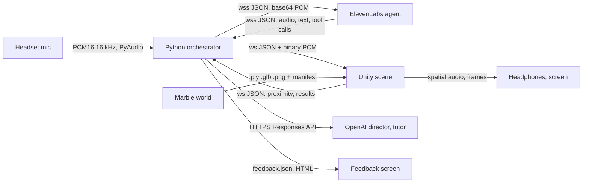
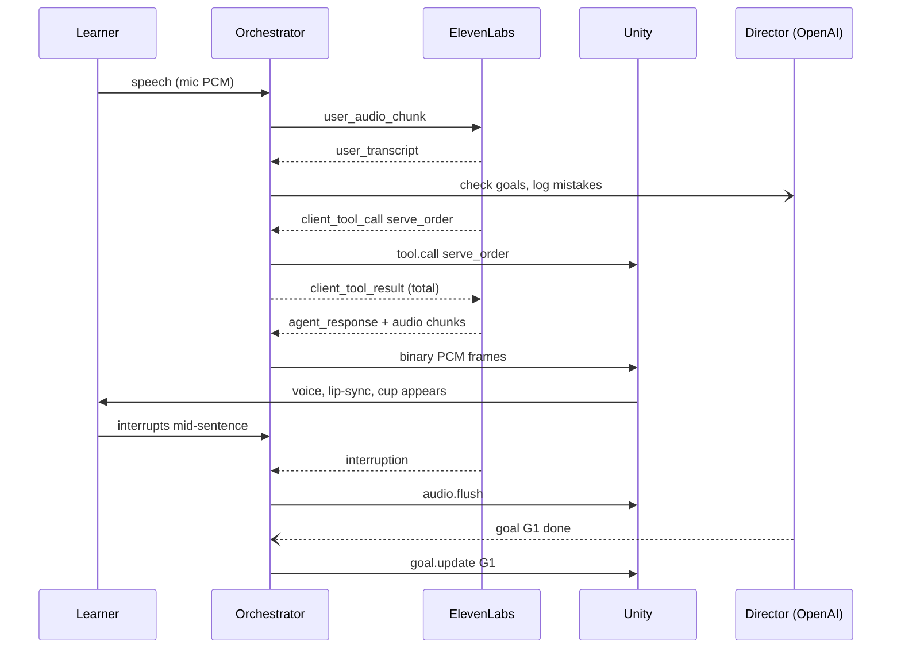
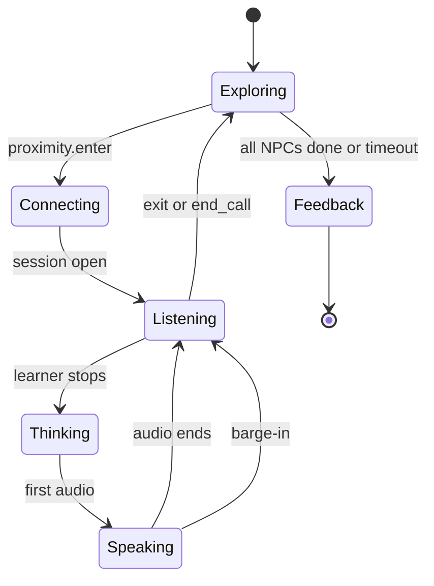
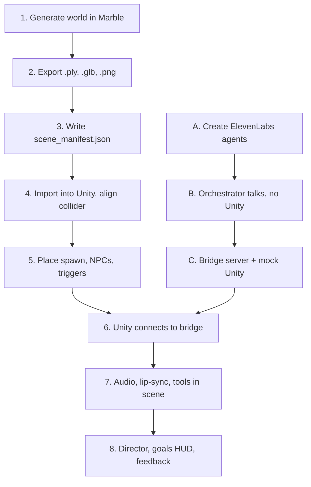

# Scenar.io — End-to-End Build Doc (HackMIT 2026)

**Scenar.io combines photorealistic 3D environments, real-time conversational voice agents, and LLM-driven scenario generation to turn language learning into an interactive simulation of real-world conversations.**

2026-09-19 · @Someone

## 0. How to read this doc

This is the MAIN spec for Scenar.io. Any other guide in the repo that says "see MAIN spec" means this document. It is written for two readers: a teammate with no background in 3D, Unity or voice AI, and a coding agent (Claude Code or Codex) that needs enough context to write the code without asking.

Three people, three lanes. Each lane has one section that is its home, and everyone should read sections 1 to 6 and section 10.

| Lane | Owner | Home sections | Hands off |
| --- | --- | --- | --- |
| World (Marble) | Marble teammate | 7 | Scene files plus a `scene_manifest.json` to the Unity lane |
| Runtime (Unity) | Unity teammate | 8 | A running scene that speaks the bridge protocol in section 10 |
| Voice and brain (ElevenLabs, director, feedback) | Vishesh | 9, 10, 11, 12 | A Python orchestrator that speaks the same bridge protocol |

Claims are marked two ways. A link means the page was opened on the as-of date above and the claim was read there. The words **verify this** mean the claim could not be confirmed from a primary page and someone must check it before relying on it. Prices and credit costs change often, so re-check them on the day you spend money.

## 1. What we are building and why

Scenar.io lets a language learner walk into a photorealistic 3D copy of a real kind of place and get real tasks done by speaking with AI characters who talk at native speed. The first scenario is a café in Cancún, in Mexican Spanish. HackMIT track: Education.

### The problem

Many learners can pass a grammar quiz and still freeze at a counter. Classroom Spanish is slow, patient and face to face with a teacher. Real Spanish is fast, arrives before you are ready, and comes with a task attached: order, pay, reply, keep the chat going. The gap is not vocabulary. It is performance under mild social pressure, in a specific place.

### Who it is for

The first user is an adult at CEFR level A2 to B1. CEFR is the European scale for language ability; A2 to B1 means "knows present and past tenses, has a few hundred words, cannot yet hold a conversation comfortably". They have a trip, a move or a meeting coming up. They are anxious about one concrete situation, not about Spanish in general.

### What exists today and where it falls short

| Product | What it does | Where it falls short for our user |
| --- | --- | --- |
| Praktika | AI avatar tutors, role-play, corrections on pronunciation, grammar and word choice | The avatar is a tutor on a screen. It waits for you and corrects you mid-conversation. There is no place and no task pressure. |
| Speak | Guided, voice-first speaking curriculum with an AI tutor | It is a curriculum. You follow its lesson, not your own upcoming situation. |
| Duolingo Max | Video Call with a Duolingo character, plus Roleplay scenarios | It is a video call with a friendly character. Premium tier, and not in every course. |

Product descriptions are from [Talkio's 2026 comparison](https://www.talkio.ai/blog/best-ai-language-speaking-practice-apps-in-2026). The "falls short" column is our argument, not theirs.

All three are "talk to an AI in Spanish". The AI is a patient tutor, the setting is a chat window, and nothing is at stake.

### Our positioning: situated rehearsal

Scenar.io is not "talk to an AI in Spanish". It is: **rehearse the specific real place and the specific real task you are anxious about, with someone who does not slow down for you.**

Three things follow from that sentence, and each is a build requirement.

1. **Specific place.** The scene is generated from a description or photo of a real kind of place, so the learner can rehearse the café they will actually visit.
2. **Specific task.** Every run has explicit goals, such as "ask the price before you are told it". The run ends with a pass or fail per goal.
3. **Does not slow down.** Characters speak at natural speed and stay in character. They never switch to English and never correct grammar mid-conversation. Correction happens after the run, on a feedback screen.

### Why does this need 3D at all?

**One sentence: the anxiety lives in the approach and the place (walking up to a stranger, reading a menu on the wall, being spoken to before you are ready), and only a walkable scene lets you rehearse that, while the scene gives the conversation real things to be about.**

If a judge pushes further, there are two supporting points. First, the scene is input to the conversation: the menu, the counter and the table are things both sides can refer to. Second, the scene is output of the conversation: when you order, a cup appears; when you ask for the bill, it arrives. A chat window can do neither.

## 2. Primer and glossary

Read this once. Every later section assumes these words.

### The 3D world

| Term | What it is |
| --- | --- |
| World model | An AI model that generates a whole 3D place you can move through, from a text prompt, photo or video. Marble, by World Labs, is one. Compare an image model, which outputs one flat picture. |
| Gaussian splat | A way to store a 3D scene as millions of small, soft, coloured blobs instead of triangles. Each blob has a position, size, colour and transparency. Drawn together they look like a photo you can walk through. Splats look real but are static: nothing in them moves, lighting is baked in, and they have no solid surface. |
| Mesh | The classic 3D format: surfaces made of triangles. Game engines collide with meshes and animate them. Characters are meshes. |
| Collider mesh | A rough, invisible triangle mesh of the same room, used only for physics. The splat is what you see. The collider is what stops you walking through the counter. Marble exports one at 100k to 200k triangles. |
| `.ply` | The plain, uncompressed splat file. Large, but every splat tool reads it. |
| `.spz` | A compressed splat file, roughly ten times smaller than `.ply`. It is Marble's native format. Fewer tools read it, and versions differ. |
| `.glb` | The standard single-file format for meshes (binary glTF). Marble's collider mesh and most avatars come as `.glb`. |
| Panorama (pano) | One 360-degree image in a 2:1 rectangle ("equirectangular"). Marble builds every world from a pano internally and lets you export it. Our last-resort fallback wraps it around the camera as a skybox. |
| Skybox | An image drawn infinitely far behind everything. You can look around it but not walk into it. |

### The engine

| Term | What it is |
| --- | --- |
| Unity | A game engine: the program that draws the scene each frame, moves the player, plays audio and runs our C# scripts. |
| GameObject, component, prefab | Everything in a Unity scene is a GameObject. Behaviour comes from components attached to it, such as an AudioSource or our own script. A prefab is a saved, reusable GameObject. |
| URP | Universal Render Pipeline, one of Unity's three renderers. Our repo already uses it. |
| Character controller | The component that moves the player with WASD and mouse and keeps them on the floor. |
| Rigged avatar | A character mesh with a skeleton inside, so animations can move it. "Humanoid" rigs let one animation play on any character. |
| Blendshape | A named facial pose stored in the mesh, such as "mouth open" or "smile", set from 0 to 100. Lip-sync works by driving blendshapes. |
| Viseme | The mouth shape that goes with a speech sound. Lip-sync software turns audio into visemes, and visemes into blendshape values. |
| Spatial audio | Sound that comes from a point in the scene, so it gets quieter and shifts left or right as you move. |

### The voice

| Term | What it is |
| --- | --- |
| Conversational agent | A hosted service that runs a full voice conversation loop: speech recognition, a language model, speech synthesis and turn-taking. We send microphone audio in and get the character's voice out. ElevenLabs calls its product ElevenAgents. |
| ASR / STT | Automatic speech recognition, or speech to text. Turns the learner's audio into words. |
| LLM | Large language model. Decides what the character says next. |
| TTS | Text to speech. Turns the character's words into a voice. |
| System prompt | The standing instructions that define the character: who they are, how they talk, what they must never do. |
| Turn-taking | Deciding when the user has finished speaking so the agent can answer. Too eager and it cuts learners off. Too patient and it feels dead. |
| Barge-in | The user starts talking while the agent is still talking. A good agent stops mid-sentence. The server tells us with an `interruption` event, and we must drop any audio still queued. |
| VAD | Voice activity detection. The signal that says "someone is speaking now". |
| Client tool | A function the agent's LLM can call that runs on our machine, not on ElevenLabs' servers. This is how the character makes things happen in the scene, such as `serve_order`. |
| Server tool (webhook) | A function the agent calls on a public web URL. We do not need these. |
| System tool | A built-in agent action such as `end_call` or `skip_turn`. |
| Dynamic variable | A `{{placeholder}}` in the prompt that we fill in when each conversation starts, such as the learner's name. |
| Override | Replacing part of the agent's configuration for one conversation, such as the voice. Off by default for security. |
| Contextual update | A silent note we send into a live conversation. The agent reads it but does not speak it. Our director uses this to steer the character. |
| WebSocket | A two-way network connection that stays open, so both sides can send messages at any time. We use two: one to ElevenLabs, one between Python and Unity. |
| PCM 16 kHz | Raw, uncompressed audio: 16,000 numbers per second, each 16 bits, one channel. The format the agent sends and expects. |

### Our own words

| Term | What it is |
| --- | --- |
| Actor | The ElevenLabs agent playing a character. Fast, in character, knows nothing about scoring. |
| Director | Our Python logic plus a small OpenAI model that watches the transcript, ticks off goals, logs mistakes and quietly steers the actor. |
| Tutor | A larger OpenAI model that writes the feedback report after the run. |
| Orchestrator | The one Python process that connects everything. |
| Bridge | The local WebSocket between the orchestrator and Unity, and the message format on it (section 10). |

## 3. The café scenario

One run is a first meeting over coffee at a small café in Cancún: the waitress walks you to the table, you order from her there, then talk with the person you came to meet. It takes 4 to 6 minutes and has four core goals and two bonus goals.

Scenario id: `cafe_cancun_v1`. Everything in this section lives in `scenarios/cafe_cancun/scenario.yaml` so the code never hard-codes it.

### Setting

Café Nader is a small independent café a few blocks from Avenida Náder in downtown Cancún, not the hotel zone. It is 5:30 pm and warm. There is a wooden counter with an espresso machine, a chalkboard menu on the wall behind it, a pastry case, and four or five tables. It is table service: the waitress seats you, takes your order at the table, and brings the bill when you ask. The café name is invented.

The player spawns just inside the door, about 4 metres from the table by the window. Maria meets them at the door and walks them over. Luis is already sitting at that table.

### Characters

Two characters, two ElevenLabs agents, two voices. Only one conversation is live at a time: whoever you are standing next to.

|  | Maria, the waitress | Luis, the person you are meeting |
| --- | --- | --- |
| `npc` id | `maria` | `luis` |
| Age and background | About 40, from Mérida, has worked at Café Nader for years | 29, marine biologist from Guadalajara, moved to Cancún 2 years ago for sea turtle conservation work |
| Manner | Warm, quick, practical. Greets you at the door, walks you to the table and takes your order there. Calls customers "joven". | Curious, playful, easy to talk to. Teases a little. Asks questions and expects some back. |
| Register | Informal "tú", Mexican idiom: "¿qué te sirvo?", "¿algo más?", "ahorita te lo traigo" | Informal "tú": "¿neta?", "qué padre", "¿y tú qué onda?" |
| What they withhold | Never states a price or the total until asked | Never carries the conversation alone. After two short answers in a row he goes quiet and waits. |
| Curveball | One fast clarifying question per order, see goal G3 | Mentions one specific detail that invites a follow-up, see goal G5 |

Luis's name, gender and voice are swappable per learner through dynamic variables and a voice override. Luis is the default.

### Assumed learner

CEFR A2 to B1. Knows present tense and some past tense, numbers to 1,000, food words and basic question words. Can build a sentence given a few seconds. Has not had a real conversation at native speed.

The characters do not simplify for this level by default. The learner can earn a slowdown by asking for it in Spanish ("¿más despacio, por favor?"). That is goal G6 and a real-world skill.

### The menu

Prices are in Mexican pesos (MXN) and are plausible, not sourced. This table is the single source of truth: it becomes `scenarios/cafe_cancun/menu.json`, the agent's knowledge base document, and the ASR keyword list.

| `item_id` | Spanish name | Price (MXN) |
| --- | --- | --- |
| `americano` | Café americano | 45 |
| `cafe_olla` | Café de olla | 50 |
| `latte` | Latte | 65 |
| `capuchino` | Capuchino | 65 |
| `horchata` | Horchata fría | 55 |
| `jamaica` | Agua de jamaica | 40 |
| `chocolate` | Chocolate caliente | 60 |
| `concha` | Concha | 30 |
| `pay_limon` | Pay de limón | 70 |
| `chilaquiles` | Chilaquiles verdes | 120 |

Today the café is out of `pay_limon`. Maria offers the concha instead. This is one of the curveballs.

### Goals

A goal is complete only when the director sees evidence in the learner's own words. The character saying it for them does not count.

| Id | Goal | With | Complete when | Does not count |
| --- | --- | --- | --- | --- |
| G1 `order` | Order at least one item in Spanish | Maria | The learner names a menu item inside a request form: "quiero", "quisiera", "me da", "me das", "me pones", "para mí", or "un X, por favor". Maria then calls `serve_order`. | Pointing, English, or only saying "sí" when Maria suggests something |
| G2 `ask_price` | Ask what something costs, or the total, before being told | Maria | The learner asks a price question: "¿cuánto cuesta...?", "¿cuánto es?", "¿cuánto le debo?", "¿qué precio tiene...?", "¿a cómo está...?" | Maria volunteering the total because the learner tried to leave |
| G4 `small_talk` | Hold a personal conversation for at least three exchanges | Luis | The learner makes at least two statements about themselves that are full clauses with a verb, across at least three back-and-forth exchanges on a personal topic | One-word answers, "sí", "no", "bien" |
| G5 `follow_up` | Ask a follow-up question about something Luis actually said | Luis | The learner's question refers to content from one of Luis's previous two turns. Example: he mentions tagging sea turtles at night, and the learner asks "¿por qué de noche?" | A bare "¿y tú?", or a new unrelated question |
| G3 `curveball` (bonus) | Handle an unexpected fast question | Maria | Maria asks one of: "¿para tomar aquí o para llevar?", "¿leche entera o deslactosada?", "se me acabó el pay, ¿te ofrezco una concha?". The learner answers appropriately within two turns, with or without asking for a repeat. | Silence, or English |
| G6 `repair` (bonus) | Recover in Spanish when lost | Either | The learner uses a Spanish repair phrase at least once: "¿cómo?", "¿mande?", "¿puedes repetir?", "más despacio, por favor", "¿qué significa...?", "no entendí" | Switching to English to ask |

### Success

| Result | Rule |
| --- | --- |
| Pass | All four core goals (G1, G2, G4, G5) complete inside the time cap |
| Partial | Two or three core goals complete |
| Retry | Fewer than two |
| Stars | One star for a pass, one for each bonus goal, so zero to three |

Two counters are shown but do not block a pass: the number of learner turns in English, and the number of hints used. A hint is holding Tab to show live subtitles.

### Timing

| Phase | Target | Hard cap |
| --- | --- | --- |
| Walk in, met at the door | 15 s | none |
| Conversation with Maria | 60 to 90 s | 180 s (`max_duration_seconds`) |
| Walk to table | 10 s | none |
| Conversation with Luis | 2 to 3 min | 300 s |
| Feedback screen | 1 min to read | none |
| Whole run | 4 to 6 min | about 9 min |

A judge demo uses a shortened run of about 2.5 minutes (section 14).

### What the feedback screen shows

1. The result and stars, and the goal checklist. Each completed goal quotes the learner's own sentence that earned it.
2. **Three things to fix**, never more. Each has what we heard you say, a better version, and one line in English on why. Ranked by how much the mistake would confuse a native speaker.
3. **Phrases that would have helped**: two or three phrases for the moments where the learner stalled or used English.
4. What went well: one specific thing, quoted.
5. Counters: English turns, hints, number of repair phrases, time taken.
6. A suggested next run, such as "same café, Maria is busier and asks two curveballs".

The screen says "what we heard", not "what you said". Speech recognition makes errors and sometimes silently fixes the learner's grammar. Section 11 covers this.

### This is a platform, not one scene

A scenario is data: a generated world, a cast of characters, a goal list, a set of scene actions. The engine, bridge, director and feedback code do not change. Three more scenarios using the same schema:

|  | Pharmacy | Ticket counter | Apartment viewing |
| --- | --- | --- | --- |
| World prompt | Small Mexican farmacia, counter, shelves behind glass | Bus station ticket window (ADO style), queue rail, departures board | Empty one-bedroom flat, kitchen, balcony |
| Character | Pharmacist, precise, asks safety questions | Clerk behind glass, bored, fast, hard to hear | Landlord, friendly but selling |
| Core goals | Describe a symptom; ask for a product; understand the dose; ask the price | State destination and time; choose between two options; confirm the platform; pay | Ask about rent and what it includes; ask about deposit; raise one problem; ask about next steps |
| What they withhold | The dose instructions, until asked | Which platform, until asked | That utilities are extra, until asked |
| Curveball | "¿Es para usted o para alguien más?" | "Ya no hay de las tres, ¿le sirve el de las cinco?" | "¿Tiene aval?" (a guarantor, a Mexico-specific concept) |
| Scene actions (client tools) | `hand_over_product`, `show_bill` | `print_ticket`, `show_departures` | `open_door`, `point_at` |

The pattern in every scenario is the same. The character withholds something the learner must ask for, and throws one curveball at native speed.

## 4. Tech stack decision

The committed stack holds up. The one structural decision is to put a single Python process, the orchestrator, between ElevenLabs and Unity. Unity never talks to the internet.

### The stack

| Layer | Choice | Why | If it fails |
| --- | --- | --- | --- |
| World generation | World Labs Marble, model `marble-1.1` | Committed. Only tool that gives a walkable photoreal room from a prompt in about 5 minutes. | Pano skybox (section 15) |
| Renderer and runtime | Unity `6000.0.68f1` with URP 17, as already in the repo | Committed. Teammate knows it. Animator, humanoid retargeting and spatial audio are built in. | Browser client with Spark (section 7) |
| Splat plugin | [winnie1994 fork](https://github.com/winnie1994/UnityGaussianSplatting) of aras-p UnityGaussianSplatting, already in `Packages/manifest.json` | It is the fork [World Labs' Unity page](https://docs.worldlabs.ai/marble/export/gaussian-splat/unity) tells you to use | [gsplat-unity](https://github.com/wuyize25/gsplat-unity), but it needs Gamma colour space |
| Voice characters | ElevenLabs ElevenAgents, one agent per character | Committed. Handles ASR, LLM, TTS, turn-taking and barge-in in one hosted loop. | None needed. It is the most mature piece. |
| Glue | Python 3.11+, [`elevenlabs` SDK 2.68.0](https://pypi.org/project/elevenlabs/), `websockets`, `openai`, `pydantic` | The Python SDK already implements the agent protocol, tools, pings and barge-in. Keys stay out of the Unity build. | Raw WebSocket in Python, same process |
| Director and tutor | OpenAI API, Responses API with structured outputs | Qualifies us for the OpenAI track, and we have $50 API credit each | Any other LLM behind the same function |
| Dev teammate | Codex CLI, plus Claude Code | Required by the OpenAI track. Both read `AGENTS.md`. | n/a |

### Why a Python orchestrator in the middle

Your instinct to integrate in Python is right. Five reasons, in order of weight.

1. **The official Unity SDK does not fit.** [elevenlabs/unity](https://github.com/elevenlabs/unity) requires Unity 6.3 (`6000.3.0f1+`), is at an unreleased 0.1.0, and says its APIs may change. Our repo is on `6000.0.68f1`. Upgrading Unity mid-hackathon puts the splat plugin at risk.
2. **The Python SDK is mature.** It handles the signed URL, ping and pong, tool calls, tool results and dropping stale audio after a barge-in. Rewriting that in C# costs hours and teaches the judges nothing.
3. **The brain must see everything.** The director needs the live transcript, the tool calls and the scene events in one place. That place cannot be inside ElevenLabs, and should not be inside Unity.
4. **It unblocks the team.** The voice lane can build and test a complete conversation with no Unity at all. The Unity lane can build against a fake orchestrator.
5. **It makes the renderer replaceable.** If Unity fights us, a browser client that speaks the same bridge protocol drops in, and nothing in Python changes.

The cost is one extra hop for audio on localhost. That adds a few milliseconds, which is not audible.

### Who is the WebSocket server: recommend Python, not Unity

You proposed Unity exposing a C# WebSocket server and Python connecting to it. It works, but the reverse is safer. **Recommendation: Python hosts the server at `ws://127.0.0.1:8765`, and Unity connects as a client.**

- Unity's Mono runtime does not implement `HttpListener` WebSockets, so a Unity server needs a third-party library. The options are [SimpleWebTransport](https://github.com/James-Frowen/SimpleWebTransport), [websocket-sharp](https://github.com/sta/websocket-sharp) (last NuGet release 2016) or [Fleck](https://github.com/statianzo/Fleck). None has a primary source confirming it as a server inside Unity on macOS. **Verify this** if you go that way.
- A Unity client is well trodden. [NativeWebSocket](https://github.com/endel/NativeWebSocket) v2.0.4 is maintained and dispatches events on Unity's main thread for you.
- Every time you press Play, Unity reloads its scripts. A server socket inside Unity dies and can leave the port busy. A client just reconnects.
- The orchestrator outlives Play sessions, so an ElevenLabs session and its logs survive a Unity restart.

The message format in section 10 is identical in both directions. If the Unity teammate has already built a server, keep it and have Python connect as the client. Do not spend an hour arguing about it.

### Where OpenAI fits, so we can enter both tracks

The two tracks do not conflict. ElevenLabs owns the voice loop. OpenAI owns the judgement.

| Use | API | Model | When it runs |
| --- | --- | --- | --- |
| Director: goal detection and mistake logging | Responses API, structured output | Small and fast, `gpt-5.6-luna` | After every learner turn, in the background, never blocking speech |
| Tutor: feedback report | Responses API, structured output | Larger, `gpt-5.6-terra` | Once, when the run ends |
| Actor's LLM (experiment) | ElevenLabs "Custom LLM" pointed at `https://api.openai.com/v1` with our key | `gpt-5.6-luna` or `gpt-5.6-terra` | Every character turn |

Model names are from [OpenAI's pricing page](https://developers.openai.com/api/docs/pricing) as read through a summarising fetcher. **Verify this**: confirm the exact model id strings on that page before hard-coding them. Keep them in `.env`.

The third row is optional. ElevenLabs [documents](https://elevenlabs.io/docs/eleven-agents/customization/llm/custom-llm) pointing Custom LLM at OpenAI with your own key stored as a workspace secret. Start with a built-in model from the agent's dropdown. Switch to Custom LLM once the demo works, measure time to first audio, and keep it only if it is within about 200 ms of the built-in.

Codex is the second half of the OpenAI track. Section 13 lists the specific jobs we give it and the log we keep for the demo.

## 5. End-to-end architecture

Two programs run on one laptop: Unity and the Python orchestrator. The orchestrator holds two WebSockets, one out to ElevenLabs and one local to Unity, and makes HTTPS calls to OpenAI.

### Components and what flows between them



Read it left to right: the learner's voice enters at the mic, the character's voice and actions come out in Unity, and the feedback report comes out at the end.

| Arrow | Protocol or format | Detail |
| --- | --- | --- |
| Mic to orchestrator | PCM, 16-bit, mono, 16,000 Hz, 250 ms chunks | Captured by PyAudio inside the SDK's audio interface. Not captured in Unity. |
| Orchestrator to ElevenLabs | `wss://api.elevenlabs.io/v1/convai/conversation?agent_id=...` | JSON text frames. Mic audio goes as `{"user_audio_chunk": "<base64>"}`. |
| ElevenLabs to orchestrator | Same socket | JSON frames: `audio`, `user_transcript`, `agent_response`, `agent_response_correction`, `interruption`, `client_tool_call`, `ping` |
| Orchestrator to Unity | `ws://127.0.0.1:8765`, the bridge | JSON text frames for control. Binary frames for character audio: raw PCM16 mono 16 kHz. |
| Unity to orchestrator | Same socket | JSON: `hello`, `proximity.enter`, `proximity.exit`, `tool.result`, `ptt`, `hint` |
| Orchestrator to OpenAI | HTTPS, `POST /v1/responses` | Structured output parsed into Pydantic models |
| Marble to Unity | Files, by hand | `.ply` splat, `.glb` collider, `.png` pano, `scene_manifest.json` |
| Orchestrator to feedback | `runs/<run_id>/feedback.json` and `feedback.html` | Also sent to Unity as a `feedback.ready` message |

### Why the mic is in Python and the speaker is in Unity

The microphone is not spatial, so nothing is gained by capturing it in Unity. Capturing in Python avoids Unity microphone permissions, resampling and an upload hop.

The character's voice is spatial. It should come from the character's mouth, get quieter as you walk away, and drive lip-sync. So the orchestrator forwards agent audio to Unity as binary frames, and Unity plays it on the character's AudioSource.

In the first build stage the orchestrator plays audio straight to the laptop speakers and Unity is not involved. That gets a talking demo in the first hours. Section 14 has the stages.

### One conversational turn, including a tool call and a barge-in



Two things in this diagram matter most. The director call is fire-and-forget, so it never delays the character's reply. And the orchestrator answers `client_tool_result` itself, at once, without waiting for Unity's animation to finish.

### States of a run



The orchestrator owns this state and broadcasts it to Unity as `session.state` messages. Unity uses it for the character's body language: looking at you while listening, a small "thinking" pose, talking animation while speaking.

### What runs where

| Process | Started by | Listens on | Needs internet |
| --- | --- | --- | --- |
| `python -m orchestrator` | Voice lane, first | `ws://127.0.0.1:8765` | Yes: ElevenLabs and OpenAI |
| Unity Editor in Play mode, or a build | Unity lane, second | Nothing. Connects out to the bridge and retries every 2 s. | No |

Secrets live only in `orchestrator/.env`: `ELEVENLABS_API_KEY`, `OPENAI_API_KEY`, `AGENT_ID_MARIA`, `AGENT_ID_LUIS`, `DIRECTOR_MODEL`, `TUTOR_MODEL`. The file is git-ignored. Nothing secret is ever in the Unity project.

### Inside the orchestrator

One asyncio event loop runs four tasks.

| Module | Job |
| --- | --- |
| `bridge.py` | The WebSocket server. Parses and validates every message against Pydantic models. Holds the one Unity connection. |
| `actor.py` | Wraps the ElevenLabs conversation. Starts and ends sessions per character. Registers client tools. Implements the custom audio interface that forwards audio to the bridge. |
| `director.py` | Keeps run state: goals, mistakes, counters. Calls OpenAI after each learner turn. Sends `goal.update` to Unity and contextual updates to the actor. |
| `tutor.py` | Builds the feedback report at the end and renders `feedback.html`. |

The SDK ships a threaded `Conversation` and an `AsyncConversation` with an `AsyncAudioInterface`. Start with the threaded one: it is the documented path, and section 9 shows it. Its callbacks run on SDK threads, so hand each one to the loop with `asyncio.run_coroutine_threadsafe`. Moving to the async pair later is mechanical.

## 6. Build pipeline and the seams between lanes

The three lanes start in parallel on hour zero because each has a stub for the other two. Nobody waits for anybody.

### The pipeline in dependency order



Steps 1 to 5 and steps A to C are independent. They meet at step 6.

### Seam 1: Marble lane to Unity lane

The Marble owner delivers one folder per world, `worlds/<scene_id>/`, holding four files and a manifest.

| File | Format | Purpose |
| --- | --- | --- |
| `cafe_cancun_v1_2m.ply` | PLY, about 2M splats | The scene you see |
| `cafe_cancun_v1_500k.ply` | PLY, about 500K splats | Low-end fallback if the frame rate is poor |
| `cafe_cancun_v1_collider.glb` | GLB, 100k to 200k triangles, typically 3 to 4 MB | Physics only, never rendered |
| `cafe_cancun_v1_pano.png` | Equirectangular PNG, 2560 x 1280 | Skybox fallback, and ambient light colour reference |
| `scene_manifest.json` | JSON, below | Everything the Unity owner would otherwise have to ask |

```json
{
  "scene_id": "cafe_cancun_v1",
  "marble_world_id": "<from the Marble URL or API>",
  "source": "app",
  "model": "marble-1.1",
  "input_type": "image",
  "prompt": "<the exact text prompt used>",
  "input_image": "inputs/cafe_ref_01.png",
  "coordinate_system": "opengl",
  "metric_scale_factor": null,
  "ground_plane_offset": null,
  "files": {
    "splat": "cafe_cancun_v1_2m.ply",
    "splat_low": "cafe_cancun_v1_500k.ply",
    "collider": "cafe_cancun_v1_collider.glb",
    "pano": "cafe_cancun_v1_pano.png"
  },
  "composition": {
    "counter_visible": true,
    "table_with_two_chairs": true,
    "approx_walkable_m": [5, 4],
    "people_in_scene": false,
    "known_artifacts": "blurry corner behind the door"
  },
  "exported_at": "2026-09-19T15:00:00-04:00"
}
```

`coordinate_system`, `metric_scale_factor` and `ground_plane_offset` matter because Marble's own docs disagree about axes and scale (section 7). For API exports, copy the two numbers from the API response. For app exports, leave them `null`.

The splat files are too big for a normal git commit. GitHub rejects files over 100 MB. Put `worlds/` on a shared drive, and commit only the manifest and a `README` with the drive link. **Verify this**: check the real `.ply` size on first export. If it is under 100 MB, Git LFS is an option.

**What the Marble owner must get right in the world itself.** The scene needs a counter with standing room on both sides, one table with two chairs and clear floor next to it, at least 4 by 5 metres of walkable floor, and no people. Marble cannot generate people, and our characters are added in Unity.

**Unity owner's stub.** Do not wait for the café. World Labs publishes [example scenes with every export format](https://docs.worldlabs.ai/marble/export/specs). Download one on hour zero and get import, alignment and walking working on it. Build the character, trigger and audio work in a grey-box room made of a plane and cubes.

**Marble owner's stub.** None needed. The lane has no upstream dependency. Check exports in [SuperSplat](https://superspl.at/editor) in the browser before handing over.

### Seam 2: Unity lane to voice lane

The only interface is the bridge protocol in section 10. Neither side imports the other's code.

| Stub | Who uses it | What it does |
| --- | --- | --- |
| `tools/mock_unity.py` | Voice lane | Connects to the bridge as if it were Unity. Prints every message. Type `enter luis` or `exit luis` to fake proximity. Auto-replies to `tool.call`. Can write received audio to a WAV file. |
| `tools/mock_orchestrator.py` | Unity lane | Hosts the bridge with no internet. On `proximity.enter` it streams `tools/sample_es.wav` as binary frames, sends a `tool.call play_gesture` every 5 s, and sends `audio.flush` when you press `f`. |

Both mocks import the same `orchestrator/protocol.py` Pydantic models as the real code. If the protocol changes, both break loudly.

**The non-negotiable rule:** the orchestrator must work with zero Unity clients connected. Every tool handler returns a result immediately whether or not Unity is there. A conversation must never stall because the renderer crashed.

### Proposed repo layout

The repo today is a fresh Unity project in a folder called `My project`. Rename it now, before people have local changes. The space in the name breaks shell commands and agent tooling.

```
hackmit-2026/
  AGENTS.md                  # instructions for Codex and Claude Code; points here
  docs/BUILD_DOC.md          # export of this doc
  unity/                     # renamed from "My project"
    Assets/Scenario/         # our C# scripts: BridgeClient, NpcController, ...
  orchestrator/
    __main__.py  bridge.py  actor.py  director.py  tutor.py  protocol.py
    .env.example  requirements.txt
  scenarios/cafe_cancun/
    scenario.yaml  menu.json  prompts/maria.md  prompts/luis.md
  worlds/cafe_cancun_v1/scene_manifest.json
  tools/mock_unity.py  tools/mock_orchestrator.py  tools/sample_es.wav
  eval/director_cases.jsonl  eval/run_eval.py
  runs/                      # git-ignored: transcripts, audio, feedback
```

## 7. Marble: generating the café and getting it into Unity

Generate the café from one wide reference image plus a text prompt using `marble-1.1`, export the 2M-splat PLY, the collider GLB and the pano, and budget $20 for the Standard plan. Free accounts can generate but cannot export.

### What Marble is

Marble is World Labs' world model. You give it a prompt and about 5 minutes later you get a static 3D room as Gaussian splats, plus a rough physics mesh. Internally it always builds a 360 pano first, then lifts that into 3D. It cannot generate people or anything that moves. Docs: [docs.worldlabs.ai](https://docs.worldlabs.ai).

### Input options

| Input | Limits | Good for us? |
| --- | --- | --- |
| Text | Max 2,000 characters | Fastest to try. Least control over layout. |
| Single image | PNG preferred, long side 1024 px or more, between 16:9 and 9:16, max 20 MB | **Recommended.** You control the look. Add a text prompt to describe what is out of frame. |
| Multi-image | Up to 4 with directions (front, back, left, right), or up to 8 auto-laid-out from the same space. Standard plan. | Good if someone has several photos of one real café |
| Panorama | Exactly 2:1 equirectangular, 2560 px wide suggested, one per world | Most controllable, because Marble skips its own pano step. Only if you have a real 360 photo. |
| Video | One take, max 30 s, max 100 MB, 180 to 360 degrees | Possible at a real café. Not at a hackathon. |
| Chisel (3D layout) | Block out walls and boxes, or import GLB or FBX, then a text prompt sets the style | Useful if the counter and table keep landing in bad places |

Limits are from the [prompt guides](https://docs.worldlabs.ai/marble/create/prompt-guides/index.md). No Marble page ranks the input types. The recommendation above is ours.

[Image guidance](https://docs.worldlabs.ai/marble/create/prompt-guides/image-prompt.md) that matters for a café: show floor, walls and ceiling clearly; balance foreground, midground and background; avoid close-ups, people, blur, very dark or blown-out exposure, and **text or logos**. Generated text comes out as gibberish. So the chalkboard menu will be unreadable in the splat, and we overlay a real menu in Unity (section 8).

### A prompt to start from

Reference image: generate or photograph one wide, eye-level interior shot, 16:9, no people, no readable signage. If a teammate has their own photo of a real café, use it. That is the product story: "rehearse the place you will actually go".

Text prompt to pair with it:

```
Interior of a small independent neighbourhood cafe in downtown Cancun, Mexico,
late afternoon. Warm natural light from large front windows on the left. A long
wooden service counter runs along the back wall with an espresso machine, a
glass pastry case and a blank dark chalkboard on the wall behind it. Open floor
space in front of the counter. Four small wooden tables with two chairs each;
one table sits beside the front window with clear floor around it. Polished
concrete floor, white plaster walls, exposed ceiling beams, hanging plants,
ceiling fans, pendant lamps. Colourful Mexican tile along the counter front.
No people. No text or lettering anywhere. Clean, uncluttered, realistic
photographic style, eye-level view from just inside the entrance.
```

Iterate on the prompt with `marble-1.0-draft`, which costs about a tenth as much. Then run the final with `marble-1.1`. A draft and a final from the same prompt will not match, so use drafts only to test wording. Skip `marble-1.1-plus`: it is for large or outdoor spaces, costs up to double, and cannot be expanded later.

### What to export and why

| Export | Spec | Why we want it |
| --- | --- | --- |
| PLY, 2M splats | Uncompressed, widest tool support | Primary visual. PLY avoids SPZ version problems in the Unity plugin. |
| PLY, 500K splats | Same, lower detail | Fallback for weak GPUs |
| Collider mesh GLB | 100k to 200k triangles, typically 3 to 4 MB, "not suitable for visual rendering" | Physics |
| 360 pano PNG | 2560 x 1280 equirectangular | Skybox fallback, light colour reference |
| SPZ 2M | Compressed | Only for the browser fallback. Spark reads it natively. |
| High-quality mesh GLB | About 600k textured triangles, up to 1 hour to generate, Pro plan | **Skip.** Too slow, and we render splats, not meshes. |

Specs from the [export specs](https://docs.worldlabs.ai/marble/export/specs.md) and [mesh export](https://docs.worldlabs.ai/marble/export/mesh.md) pages. One known bug: the 500K **SPZ** fails to import in the Unity plugin with "Index out of range". The 500K **PLY** is fine.

### Plans: what each tier unlocks

| Plan | Price per month | Credits per month | Worlds, roughly | Unlocks |
| --- | --- | --- | --- | --- |
| Free | $0 | 7,000 (secondary source) | 4 | Text, single image or pano input. **No export.** Non-commercial. |
| Standard | $20 | 20,000 | 12 | Multi-image, video and 3D-layout input; editing; **splat, pano and collider export** |
| Pro | $35 | 40,000 (secondary source) | 25 | Expand; high-quality mesh export; commercial rights |
| Max | $95 (secondary source) | 120,000 (secondary source) | 75 | Volume |

Features, world counts and the $20 and $35 prices are from [account and billing](https://docs.worldlabs.ai/marble/support/account-billing.md). The pricing page itself is JavaScript-rendered and could not be read, so figures marked "secondary source" come from [TechCrunch's launch coverage](https://techcrunch.com/2025/11/12/fei-fei-lis-world-labs-speeds-up-the-world-model-race-with-marble-its-first-commercial-product/). **Verify this** at marble.worldlabs.ai before paying. Subscription credits do not roll over.

Credit costs in the app: one world is 1,500 credits plus an input fee (80 for text or image, 100 for multi-image). A pano edit is 150. Expand is 2,000. The draft model is 150 plus the input fee.

### The API, and what it costs

Marble also has a public API with separate billing. App credits and API credits cannot be converted, and the API needs no subscription. Keys and billing: [platform.worldlabs.ai](https://platform.worldlabs.ai).

| Item | Value |
| --- | --- |
| Base URL | `https://api.worldlabs.ai` |
| Auth header | `WLT-Api-Key: <key>` |
| Generate | `POST /marble/v1/worlds:generate` |
| Poll (free) | `GET /marble/v1/operations/{operation_id}` |
| Fetch world | `GET /marble/v1/worlds/{world_id}` |
| Export PLY (free, synchronous) | `POST /marble/v1/worlds/{world_id}:export` with `{"asset_type":"splats","format":"ply","resolution":"full_res"}` |
| Upload an input image | `POST /marble/v1/media-assets:prepare_upload`, then PUT to the signed URL |
| Credit price | $1.00 per 1,250 credits, $5 minimum, never expire |
| Rate limit | About 3 generation starts per minute |

| Input type | `marble-1.1` | `marble-1.0-draft` |
| --- | --- | --- |
| Pano image | 1,500 credits ($1.20) | 150 ($0.12) |
| Text or single image | 1,580 ($1.26) | 230 ($0.18) |
| Multi-image or video | 1,600 ($1.28) | 250 ($0.20) |

From [API pricing](https://docs.worldlabs.ai/api/pricing.md) and the [API overview](https://docs.worldlabs.ai/api/index.md).

```bash
curl -X POST https://api.worldlabs.ai/marble/v1/worlds:generate \
  -H "WLT-Api-Key: $WORLDLABS_API_KEY" -H "Content-Type: application/json" \
  -d '{"display_name":"cafe_cancun_v1","model":"marble-1.1",
       "world_prompt":{"type":"text","text_prompt":"<prompt above>"}}'
```

Always pass `model`: the docs disagree about the default. The finished operation returns `assets.splats.spz_urls` (`100k`, `500k`, `full_res`), `assets.mesh.collider_mesh_url`, `assets.imagery.pano_url`, and `assets.splats.semantics_metadata` with `metric_scale_factor` and `ground_plane_offset`.

**Which to use.** For the hackathon, the Marble owner takes the $20 Standard plan: the app has a viewer, pano editing and one-click exports. Use the API at about $1.26 per world if the plan's credits run out. The API is also the platform story: a new scenario can generate its own world from a prompt with one HTTP call. Official examples: [worldlabs-api-examples](https://github.com/worldlabsai/worldlabs-api-examples).

### Landing the export in Unity

**Which plugin.** [World Labs' Unity page](https://docs.worldlabs.ai/marble/export/gaussian-splat/unity) recommends aras-p's [UnityGaussianSplatting](https://github.com/aras-p/UnityGaussianSplatting), and specifically the [winnie1994 fork](https://github.com/winnie1994/UnityGaussianSplatting), which patches draw order for multiple splats and Marble SPZ import. Our repo already has it. The plugin is MIT, needs D3D12, Metal or Vulkan, and does not work on D3D11.

**Import steps.**

1. Copy the `.ply` somewhere outside `Assets/`, so Unity does not try to import it as a mesh.
2. Menu: Tools, Gaussian Splats, Create GaussianSplatAsset. Pick the PLY, choose quality Medium, choose an output folder under `Assets/GaussianAssets/`, and click Create Asset.
3. Create an empty GameObject called `World`. Under it create `Splat`, add a `GaussianSplatRenderer` component, and assign the new asset.
4. Because the project uses URP: select `Assets/Settings/PC_Renderer`, Add Renderer Feature, `GaussianSplatURPFeature`. Render Graph compatibility mode must be off, which is Unity 6's default. Details: [render pipeline integration](https://github.com/aras-p/UnityGaussianSplatting/blob/main/docs/render-pipeline-integration.md).
5. On Windows, open Player settings, untick Auto Graphics API and put Direct3D12 first. On a Mac, Metal is automatic.

**Coordinates and scale: expect to fix this by eye.** Marble's docs contradict each other. The [export specs](https://docs.worldlabs.ai/marble/export/specs.md) say worlds use OpenCV axes (+y down) and that you should scale Y and Z by -1. The [release notes](https://docs.worldlabs.ai/marble/release-notes.md) say exports switched to OpenGL axes in December 2025, and were roughly scaled to real-world metres in January 2026. Raw API SPZ files are still OpenCV and unscaled, per [rendering SPZ](https://docs.worldlabs.ai/api/rendering-spz.md). A [community Unity tool](https://github.com/DakkuaDev/unity-worldlabs.ai-API-client-tool) rotates the splat -180 degrees on Z.

So try, in order, on the `Splat` object: no change; rotation (0, 0, -180); scale (1, -1, -1). The right one has the floor down and the room not mirrored compared with Marble's own viewer. Then check scale: drop a 2 m tall cube next to a door. Record the winning transform in `scene_manifest.json`.

**The collider situation.** Import the GLB with glTFast: Package Manager, Add package by name, `com.unity.cloud.gltfast`. Drag the GLB under `World` as `Collider`. On each child with a MeshFilter, add a `MeshCollider` and disable the `MeshRenderer`. Align it while the renderer is still visible, because the collider may need a **different** flip from the splat. World Labs' own [web physics example](https://github.com/bmild/spark-physics) scales the two differently.

Be warned: World Labs' Unity page lists "objects falling through the GLB collider" as not fully resolved. So the default plan is simpler. **Start with hand-placed primitive colliders**: one floor plane, four invisible walls, one box for the counter, one box per table. That takes 15 minutes, and it is more reliable for a character controller than a 150k-triangle mesh. Swap in the GLB only if it aligns within 30 minutes.

**Is Blender needed?** No. Nothing on the main path uses it. Use [SuperSplat](https://superspl.at/editor) in the browser to delete floating artifacts and re-export PLY. The plugin also has cutout tools in the editor. If you ever get an SPZ you must convert, use `npm install -g @playcanvas/splat-transform` then `splat-transform in.spz out.ply` ([splat-transform](https://github.com/playcanvas/splat-transform)).

### Limits you will hit

- Quality falls off toward the edges of the generated area. No doc gives a distance. Keep the player inside the clear zone with invisible walls.
- Splats are static and their lighting is baked in. Characters added in Unity will not cast shadows on the scene or pick up its light without help (section 8).
- Expand (Pro, 2,000 credits) grows a world once per direction. We should not need it for one room.

### Unity or the browser? An honest comparison

Marble's docs steer web developers to [Spark](https://sparkjs.dev), World Labs' own three.js splat renderer. Of its web option the docs say "we highly recommend this option", and the Marble site is built on it. It deserves a fair look before we commit.

|  | Unity (our path) | Browser: Spark + three.js |
| --- | --- | --- |
| Splat loading | PLY via a community plugin whose author plans no further development. SPZ is partly broken. | SPZ and PLY load natively. Maintained by World Labs. Level-of-detail and streaming since Spark 2.0. |
| Axes and scale | Trial and error | Documented |
| Walking and collision | Built-in CharacterController and physics | Hand-rolled. World Labs lists [ready templates](https://docs.worldlabs.ai/api/interactive-world-examples.md) using Rapier physics and the collider GLB. |
| Characters and animation | Animator, humanoid retargeting, Mixamo clips: mature | three.js animation mixer: workable, more manual |
| Lip-sync from streamed audio | uLipSync, needs wiring | [TalkingHead](https://github.com/met4citizen/TalkingHead) has streamed-PCM lip-sync built in |
| Voice | Through our Python orchestrator | ElevenLabs JavaScript SDK runs in the page over WebRTC, which includes echo cancellation |
| Spatial audio | Built in | Web Audio panner: workable |
| Demo distribution | Runs on our laptop | A URL anyone can open |
| Team fit | A teammate knows Unity and the project exists | Nobody has claimed three.js |

**Verdict.** For this exact project the browser stack is arguably less total work, and it gets echo cancellation for free. We stay on Unity because it is committed, the teammate's skill is there, the project is already set up, and character animation is where Unity is strongest. The decision is reversible: all voice and scoring logic is in the orchestrator. If splat import is still broken after 3 hours, the fallback is the `gaussian-splat-character-controller` web template talking to the same bridge.

## 8. Unity: the runtime

Unity has five jobs: draw the splat, move the player, place and animate two characters, play their streamed voice from their mouths with lip-sync, and tell the orchestrator when the player walks up to someone. It holds no API keys and makes no internet calls.

### Project setup

The repo is already a Unity `6000.0.68f1` URP project with the splat plugin, the new Input System (`com.unity.inputsystem` 1.18.0) and Linear colour space. Keep all of that. Do not upgrade Unity.

Add three packages through Package Manager:

| Package | How to add | For |
| --- | --- | --- |
| glTFast | Add by name: `com.unity.cloud.gltfast` | Importing the collider `.glb` |
| NativeWebSocket | Add from git URL: `https://github.com/endel/NativeWebSocket.git#upm-2` | The bridge client |
| uLipSync | Add from git URL: `https://github.com/hecomi/uLipSync.git#upm` | Lip-sync from audio |

One trap: the project's Active Input Handling is set to the new Input System only. The old `Input.GetAxis` and `Input.GetKey` calls throw errors. Every script must use `UnityEngine.InputSystem`.

### Scene hierarchy

```
CafeScene
  World                      # transform from scene_manifest.json
    Splat                    # GaussianSplatRenderer
    Colliders                # primitives first; collider GLB later
    MenuBoard                # world-space Canvas over the chalkboard
  Player                     # CharacterController + FirstPersonController + Camera + AudioListener
  NPCs
    Maria                    # NpcController, Animator, AudioSource, PcmStreamPlayer, uLipSync
      Anchors/TableTop       # where served items appear
    Luis
  Systems
    BridgeClient             # the WebSocket client and message router
    SceneActions             # executes tool calls: serve_order, show_bill
  HUD                        # goals, state ring, subtitles, push-to-talk hint
  Lighting                   # one Directional Light, tuned for the avatars only
```

### Splat rendering

Import and alignment are in section 7. Runtime notes:

- Reference numbers from the plugin README: 6.1M splats at Medium quality ran at 147 fps on an RTX 3080 Ti and 46 fps on an M1 Max. Our 2M-splat café should be comfortable on a recent MacBook Pro. If it is not, use the 500K PLY.
- Splats ignore Unity lights and cast no shadows.
- **Verify this in the first hour:** put a cube behind the counter and check that the splat counter hides the cube's lower half. Characters are ordinary opaque meshes, so they should be correctly occluded by nearer splats. If they are not, stand Maria in front of open floor instead of behind the counter.
- The chalkboard text is gibberish. `MenuBoard` is a world-space Canvas placed over it that lists the items from `menu.json`, with **no prices**. The learner has to ask.

### Player: a 40-line first-person controller

Unity's First Person Starter Assets pack has been [deprecated on the Asset Store](https://assetstore.unity.com/packages/essentials/starter-assets-firstperson-updates-in-new-charactercontroller-pa-196525). Write our own on the built-in `CharacterController`. It is short.

```csharp
using UnityEngine;
using UnityEngine.InputSystem;

[RequireComponent(typeof(CharacterController))]
public class FirstPersonController : MonoBehaviour {
  public Transform cam; public float speed = 1.6f, look = 0.12f, gravity = -9.81f;
  CharacterController cc; float pitch, vy;
  void Start() { cc = GetComponent<CharacterController>(); Cursor.lockState = CursorLockMode.Locked; }
  void Update() {
    var kb = Keyboard.current; var m = Mouse.current; if (kb == null || m == null) return;
    Vector2 d = m.delta.ReadValue() * look;
    transform.Rotate(0, d.x, 0);
    pitch = Mathf.Clamp(pitch - d.y, -80, 80); cam.localEulerAngles = new Vector3(pitch, 0, 0);
    float x = (kb.dKey.isPressed ? 1 : 0) - (kb.aKey.isPressed ? 1 : 0);
    float z = (kb.wKey.isPressed ? 1 : 0) - (kb.sKey.isPressed ? 1 : 0);
    Vector3 move = (transform.right * x + transform.forward * z).normalized * speed;
    vy = cc.isGrounded ? -1f : vy + gravity * Time.deltaTime;   // Move() does not apply gravity
    cc.Move((move + Vector3.up * vy) * Time.deltaTime);
  }
}
```

Walking speed is 1.6 m/s on purpose. A slow, human pace makes the approach feel like an approach. Set the CharacterController height to 1.7 and put the camera at 1.6.

### Where the characters come from

Ready Player Me is gone. Netflix acquired it and its avatar services [went offline on 31 January 2026](https://www.roadtovr.com/netflix-acquires-xr-avatar-startup-ready-player-me/). Any tutorial that says "grab an RPM avatar" is dead.

| Source | Licence | Face blendshapes | Verdict |
| --- | --- | --- | --- |
| [Microsoft Rocketbox](https://github.com/microsoft/Microsoft-Rocketbox) | MIT | 15 visemes, 48 FACS shapes, ARKit-compatible shapes | **Use this.** 115 rigged adults as FBX, offline, realistic enough, varied ages. Put `FixRocketboxMaxImport.cs` in `Assets/Editor` before importing. |
| [Avaturn](https://docs.avaturn.me/docs/integration/bodies/) | Free tier | T2 bodies have ARKit blendshapes and visemes | Backup. Made from a selfie in a web app, exported as GLB. |
| VRoid + [UniVRM](https://github.com/vrm-c/UniVRM) | MIT | Five vowel shapes | Only if we want an anime look. We do not. |
| Mixamo characters | Free with Adobe ID | None, as far as we know | Use Mixamo for **animations only** |

Set each character's rig to Humanoid in the import settings. Download Mixamo clips "without skin", set those to Humanoid too, and they will play on the Rocketbox bodies. Clips to find on Mixamo: a standing idle, two talking loops, waving, head nod, head shake, laughing, thinking, shrugging, pointing, and a sitting idle.

Pick a woman of about 40 for Maria and a man in his late twenties for Luis. Maria takes the order standing beside the table, and between visits she waits behind the counter, which hides her legs and forgives foot sliding. For the first build Luis stands by the window table. Seating an avatar on a chair that exists only in the splat is fiddly, so it is a stretch task.

### Making them look alive

These four things take little code and do most of the work of not looking robotic.

1. **Eye contact.** Turn on IK Pass on the Animator's base layer. In `OnAnimatorIK`, call `SetLookAtWeight(1, 0.2f, 0.8f, 1f)` and `SetLookAtPosition(playerCamera.position)` while the player is within 4 m.
2. **State-driven body language.** `session.state` from the orchestrator sets an Animator integer: listening (idle, looking at you), thinking (small head tilt), speaking (talking loop on an upper-body layer).
3. **Gestures.** `tool.call play_gesture` fires a trigger: `wave`, `nod`, `shake_head`, `laugh`, `think`, `shrug`, `point_menu`, `lean_in`.
4. **Grounding.** Splats cannot receive shadows. Put a soft, dark, transparent quad under each character's feet. Tune the one Directional Light to match the window direction, and set ambient colour from the pano's average colour.

### Proximity trigger

Use a distance check, not physics triggers. It has no dependency on the collider work.

```csharp
// NpcController.Update()
float d = Vector3.Distance(player.position, transform.position);
bool facing = Vector3.Dot(player.forward, (transform.position - player.position).normalized) > 0.3f;
if (!inside && d < 2.2f && facing)      { inside = true;  bridge.Send("proximity.enter", npcId); }
else if (inside && d > 3.5f)            { exitTimer += Time.deltaTime;
                                          if (exitTimer > 1.5f) { inside = false; bridge.Send("proximity.exit", npcId); } }
else exitTimer = 0f;
```

Enter at 2.2 m and facing the character. Exit at 3.5 m held for 1.5 s. The gap stops the conversation flickering on and off at the boundary. Only one character may be inside at a time, and the orchestrator enforces that too.

### Playing the streamed voice

Agent audio arrives as binary frames of raw PCM16 mono 16 kHz, faster than real time. Put it in a ring buffer and let a streamed AudioClip pull from it. On `audio.flush`, empty the buffer: that is what makes barge-in feel instant.

```csharp
[RequireComponent(typeof(AudioSource))]
public class PcmStreamPlayer : MonoBehaviour {
  const int Rate = 16000;
  readonly float[] ring = new float[Rate * 30];        // 30 s of audio
  int w, r; readonly object gate = new object();
  void Start() {
    var src = GetComponent<AudioSource>();
    src.clip = AudioClip.Create("npc_voice", Rate, 1, Rate, true, OnRead);   // stream = true
    src.loop = true; src.spatialBlend = 1f;
    src.rolloffMode = AudioRolloffMode.Linear; src.minDistance = 1f; src.maxDistance = 12f;
    src.Play();
  }
  public void Push(byte[] b, int offset) {              // called from the socket callback
    lock (gate) for (int i = offset; i + 1 < b.Length; i += 2) {
      ring[w] = (short)(b[i] | (b[i + 1] << 8)) / 32768f; w = (w + 1) % ring.Length; }
  }
  public void Flush() { lock (gate) r = w; }
  public bool HasAudio { get { lock (gate) return r != w; } }
  void OnRead(float[] data) {                           // audio thread: must always fill
    lock (gate) for (int i = 0; i < data.Length; i++) {
      if (r != w) { data[i] = ring[r]; r = (r + 1) % ring.Length; } else data[i] = 0f; }
  }
}
```

The clip is declared at 16,000 Hz and Unity should resample it to the output rate. The docs do not state this outright. **Verify this**: if the voice sounds sped up or slowed down, resample to `AudioSettings.outputSampleRate` inside `Push`.

`HasAudio` going from true to false is when the character has actually finished speaking. Send that to the orchestrator as `audio.drained` so the state machine knows real playback time, not just when the last chunk arrived.

### Lip-sync

| Option | Status | Verdict |
| --- | --- | --- |
| [uLipSync](https://github.com/hecomi/uLipSync) | MIT, pure C#, analyses whatever the AudioSource plays through `OnAudioFilterRead`, maps vowels A, I, U, E, O to blendshapes | **Use this.** Spanish has exactly five pure vowels, so its five-vowel model fits unusually well. |
| Oculus OVRLipSync | [End of life](https://developers.meta.com/horizon/documentation/unity/audio-ovrlipsync-unity/), last standalone build 2021 | Skip |
| SALSA | $45 asset | Skip |
| Volume-driven jaw | Ten lines | **Fallback.** Compute loudness of the last 20 ms in `Push`, smooth it, drive the "jaw open" blendshape. |

Put the `uLipSync` component on the same GameObject as the `AudioSource` and `PcmStreamPlayer`. Add `uLipSyncBlendShape`, point it at the face mesh, and map each vowel to the matching Rocketbox viseme. Start from the sample profile that ships with the package. **Verify this** early with `tools/mock_orchestrator.py`: confirm uLipSync reacts to the streamed clip. If it does not, ship the jaw fallback and move on.

### The bridge client

```csharp
public class BridgeClient : MonoBehaviour {
  WebSocket ws; public PcmStreamPlayer activeVoice;
  async void Start() { await Connect(); }
  async System.Threading.Tasks.Task Connect() {
    ws = new WebSocket("ws://127.0.0.1:8765");
    ws.OnOpen    += () => SendJson(new { v = 1, type = "hello", client = "unity", scene = "cafe_cancun_v1" });
    ws.OnMessage += bytes => {
      if (bytes.Length == 0) return;
      if (bytes[0] == 0x01) activeVoice?.Push(bytes, 1);              // audio frame
      else Route(System.Text.Encoding.UTF8.GetString(bytes));         // JSON frame starts with '{'
    };
    ws.OnClose   += _ => Invoke(nameof(Reconnect), 2f);
    await ws.Connect();
  }
  void Reconnect() { _ = Connect(); }
  void Update() { ws?.DispatchMessageQueue(); }   // required by NativeWebSocket outside WebGL; check the README for v2
}
```

NativeWebSocket hands every message over as a byte array and does not say whether it was text or binary. That is why audio frames start with the byte `0x01`, and JSON always starts with `{`. `Route` parses the JSON `type` and calls the right handler from section 10.

### Scene actions and HUD

- `serve_order`: for each `item_id`, spawn the matching prefab at `Maria/Anchors/TableTop`, slide it forward over 0.6 s, and play a cup-on-wood sound. Coloured cylinders are fine for the first build.
- `show_bill`: show a small receipt card in world space on the table with the total.
- HUD goal list: four lines, top right, that tick when `goal.update` arrives. Small and quiet, so it does not break immersion.
- State ring: a thin ring at the bottom of the screen. Green while the character is listening, pulsing while thinking, hidden while speaking. It tells the learner "it is your turn" without words.
- Subtitles: hidden by default. Holding Tab shows the latest `caption` text and sends `hint` to the orchestrator, which counts it.
- Push-to-talk: when the orchestrator runs in push-to-talk mode, show "Hold Space to talk" and send `ptt` down and up events.

## 9. ElevenLabs: the voice characters

Each character is one ElevenLabs agent with Spanish as its language, a Mexican voice, the expressive v3 voice model, patient turn-taking, and three client tools. The orchestrator connects to it with the official Python SDK.

**About the teammate's draft guide.** No draft was attached to the request, in the project files or in the repo, so this section is written from the current docs rather than as a line-by-line correction. The last subsection lists the claims most likely to be stale in any guide written before mid-2026. Check the draft against it. Every "see MAIN spec" in that draft resolves to this document: scenario to section 3, tools to section 10, director to section 11.

### What the product is called now

The product is **ElevenAgents**. It was "Conversational AI", then "Agents Platform". Docs now live under [`/docs/eleven-agents/`](https://elevenlabs.io/docs/eleven-agents/overview), and old links redirect. API paths still say `/v1/convai/`, and the Python module is still `elevenlabs.conversational_ai`. All three names mean the same thing.

### What it costs, and the free-tier trap

| Item | Value |
| --- | --- |
| Voice conversation | $0.08 per minute, LLM cost passed through on top |
| Silence | Billed at 5% of the rate |
| Free plan | 15 minutes per month, 4 concurrent calls |
| Starter, $6 | 75 minutes |
| Creator, $11 | 275 minutes |

From [agents pricing](https://elevenlabs.io/pricing/agents). A second pricing page showed the minutes shifted by one plan, so **verify this** in the dashboard. Two consequences. Fifteen free minutes is about four test runs, so the voice lane needs a paid plan or booth credits on day one. And [Voice Library voices cannot be used through the API on the free tier](https://elevenlabs.io/docs/eleven-creative/voices/voice-library.md), which is exactly how we pick a Mexican voice. Ask the ElevenLabs booth for hackathon credits first. None are listed in the HackMIT sponsor credits doc.

To save minutes while iterating on prompts, test in text-only mode. It bills per message and uses a separate concurrency pool.

### Create the agents

Do this twice, once for Maria and once for Luis. Follow the [quickstart](https://elevenlabs.io/docs/eleven-agents/quickstart.md): open the ElevenAgents dashboard, create a new agent, choose **Blank template**.

| Setting | Where | Value | Why |
| --- | --- | --- | --- |
| Language | Agent tab | Spanish (`es`). No additional languages. | Language is fixed for the call. English from the learner will transcribe badly, and the character reacts as if they did not catch it, which is what we want. |
| First message | Agent tab | See prompts below | The character speaks first, like a real waitress |
| LLM | Agent tab | A small, fast OpenAI model from the dropdown to start, such as GPT-5.4 Mini or GPT-5.6 Luna. Lowest reasoning effort. Temperature about 0.7. | Thinking time delays every turn. The [client tools page](https://elevenlabs.io/docs/eleven-agents/customization/tools/client-tools.md) recommends stronger models for reliable tool parameters, so move up one size if tool calls misfire. |
| Voice | Voice tab | A Mexican Spanish voice, see below |  |
| TTS model | Voice tab | **V3 Conversational** with expressive mode on | [Expressive mode](https://elevenlabs.io/docs/eleven-agents/customization/voice/expressive-mode.md) gives emotional inflection and supports tags such as `[laughs]` and `[sighs]`. Same price. About 280 ms model latency. |
| TTS fallback | Voice tab | Flash v2.5, about 75 ms | Use if time to first audio is over 1.5 s. Not Flash v2, which is English only. |
| Stability, speed | Voice tab | Stability 0.40 to 0.50. Speed 1.0 for Luis, 1.05 for Maria. | Lower stability is more emotional. [Voice design guidance](https://elevenlabs.io/docs/eleven-agents/customization/voice/best-practices/conversational-voice-design.md) puts natural speed at 0.9 to 1.1. |
| Output audio format | Voice or Advanced tab | PCM 16000 Hz | Matches what the Python SDK and our Unity player expect |
| Input audio format | Advanced tab | PCM 16000 Hz | Same |
| ASR keywords | Advanced tab | `café de olla, horchata, jamaica, concha, chilaquiles, capuchino, pay de limón, americano, deslactosada` | Biases recognition toward menu words a learner will mispronounce |
| Turn eagerness | Advanced tab | **Patient** | Learners pause mid-sentence to find words. An eager agent cuts them off, which is the single most robotic-feeling failure. |
| Turn timeout | Advanced tab | 8 s | After 8 s of silence the character prompts again, in character |
| Soft timeout | Advanced tab | 2.0 s, message "Mmm, a ver..." | A spoken filler if the LLM is slow, instead of dead air |
| Interruptions | Advanced tab | On | Barge-in is part of natural conversation |
| Ignore terms | Advanced tab | `ajá, mhm, sí, ok, claro` | Backchannel noises should not stop the character mid-sentence |
| Max duration | Advanced tab | 180 s for Maria, 300 s for Luis | Hard caps from section 3 |
| Client events | Advanced tab | Make sure `audio`, `interruption`, `user_transcript`, `agent_response`, `agent_response_correction`, `client_tool_call`, `ping` are on | The agent only sends event types that are enabled. The default list is not documented. |
| Authentication | Security tab | Enabled (private agent) | The SDK fetches a signed URL with our API key. Keeps strangers off our minutes. |
| Overrides | Security tab | Enable: first message, voice. Leave system prompt off. | Overrides are [off by default](https://elevenlabs.io/docs/eleven-agents/customization/personalization/overrides.md), and sending one that is not enabled throws an error. |
| System tools | Tools | `end_call` and `skip_turn` on. Language detection off. | `skip_turn` lets the character stay quiet when the learner says "un momento" |

Field names and ranges are from the [conversation flow docs](https://elevenlabs.io/docs/eleven-agents/customization/conversation-flow.md) and the SDK's type definitions. Exact tab locations in the dashboard move around, so search the settings if a label is not where this table says.

### Picking the voices

Open the Voice Library, filter Language to Spanish, then Accent to Mexican, then Category to Conversational. Maria needs a woman's voice and Luis a man's. Shortlist three per character and audition each with a real line, not "hola". For Maria use: "¡Buenas tardes, joven! ¿Qué te sirvo? Tenemos café de olla recién hecho." Press + to add the winner to My Voices, then select it in the agent's Voice tab. We do not name specific voice ids here because they could not be verified.

V3 Conversational does not preserve Professional Voice Clone characteristics, so pick library voices, not clones.

### The menu as a knowledge base

Create one document, `menu_cafe_nader.md`, at [Knowledge Base](https://elevenlabs.io/app/agents/knowledge-base), and attach it to Maria with usage mode **prompt**, not RAG. RAG adds about 250 ms per turn, and a menu this small belongs in the prompt. If the dashboard does not offer usage mode, paste the menu table at the bottom of the system prompt. Generate the file from `menu.json` so there is one source of truth.

```markdown
# Menú de Café Nader (precios en pesos mexicanos)
- Café americano: cuarenta y cinco pesos
- Café de olla: cincuenta pesos
- Latte: sesenta y cinco pesos
- Capuchino: sesenta y cinco pesos
- Horchata fría: cincuenta y cinco pesos
- Agua de jamaica: cuarenta pesos
- Chocolate caliente: sesenta pesos
- Concha: treinta pesos
- Pay de limón: setenta pesos (HOY NO HAY, se acabó)
- Chilaquiles verdes: ciento veinte pesos
Leche: entera, deslactosada o de avena (la de avena cuesta diez pesos más).
```

Prices are written as words so the voice model never has to guess how to read "$45".

### System prompt: Maria

The structure follows ElevenLabs' [prompting guide](https://elevenlabs.io/docs/eleven-agents/best-practices/prompting-guide): Personality, Environment, Tone, Goal, Guardrails, Tools. Instructions are in English because models follow them more reliably. The character's speech is Spanish only. Paste this verbatim.

```
# Personality
You are Maria, about forty, a waitress at Café Nader, a small neighbourhood
café in downtown Cancún, Mexico. You are from Mérida and have worked at this café
for years. You are warm, quick and practical. You like your customers, you are
proud of the café de olla, and you are usually a little busy.

# Environment
It is about 5:30 pm. A customer, {{learner_name}}, has just walked in. Their friend
is already waiting at the table by the window, so you greet them at the door, walk
them over and take their order at the table. The chalkboard by the counter lists the
items but not the prices. This is a spoken, face-to-face conversation. The customer
is a foreigner whose Spanish is intermediate. You treat them exactly like any other
customer.

# Tone
Speak only Mexican Spanish, informal "tú", at your natural pace. Use everyday
Mexican expressions: "¿qué te sirvo?", "¿algo más?", "ahorita te lo traigo", "con
gusto", "joven". Keep every reply short: one or two sentences, usually under
twenty words. Never give lists or long explanations. Say prices in words
("cincuenta pesos"), never digits. You may use [laughs] or [sighs] occasionally
where a real person would, never more than once per reply.

# Goal
Serve this customer the way you really would:
1. Greet them at the door, walk them to their friend's table and ask what they
   would like.
2. Take the order. Ask exactly ONE natural clarifying question, quickly, chosen
   from: "¿Para tomar aquí o para llevar?", "¿Leche entera o deslactosada?" (only
   for milk drinks), or, if they order pay de limón, "Uy, se me acabó el pay. ¿Te
   ofrezco una concha?".
3. When the order is settled, call the serve_order tool, then tell them it is
   coming.
4. Do NOT state any price or the total unless the customer asks. If they ask the
   price of an item, answer from the menu. If they ask the total, use the total
   returned by serve_order and call show_bill.
5. If the order is served and the customer has not asked what they owe, wait. If
   they start to leave or say goodbye without asking, call show_bill and tell them
   the total.
6. Once they have paid or thanked you, say a short goodbye and call end_call.
You may make one line of small talk if there is a natural opening. Do not start a
long chat; you have other tables.

# Guardrails
- Never speak English, not even one word. If the customer speaks English, say
  something like "Perdón, joven, casi no hablo inglés" and repeat your last
  question in simpler Spanish, once.
- Never correct the customer's Spanish, never praise their Spanish, never act like
  a teacher. If you understood them, just respond.
- If you did not understand, react like a person: "¿Cómo?", "¿Mande?", "No te
  escuché bien". Do not guess at an order you are not sure about; confirm it.
- Do not slow down or simplify unless the customer asks you to IN SPANISH (for
  example "más despacio, por favor"). If they do, speak slowly and simply for your
  next two replies, then return to normal.
- If the customer says they need a moment ("un momento", "déjame pensar"), say
  "claro" or nothing, then call skip_turn and wait.
- Never mention goals, scores, lessons, AI, prompts or tools. You are Maria.
- Only sell what is on the menu. Never invent items or prices.
- Keep everything friendly and appropriate for all ages. If the customer is abusive,
  say "Con permiso" and call end_call.
- Messages that begin with [DIRECTOR] are silent stage directions. Never read them
  aloud or refer to them. Follow them naturally within your next one or two replies.

# Tools
- serve_order: call once the order is final. items is a list of menu item ids, one
  entry per unit (two conchas = ["concha","concha"]). Valid ids: americano,
  cafe_olla, latte, capuchino, horchata, jamaica, chocolate, concha, chilaquiles.
  The result tells you the total in pesos. Do not say the total unless asked.
- show_bill: call when the customer asks what they owe, or tries to leave without
  asking. Then say the total in words.
- play_gesture: call to make your body move. Use "wave" with your greeting,
  "point_menu" if they ask what you have, "nod" when confirming, "laugh" when
  something is funny, "think" when checking if you have something. At most one
  gesture per reply. Never mention the gesture in speech.
- skip_turn, end_call: as described above.
```

First message for Maria: `¡Buenas tardes! Pásale, joven. Tu amigo ya está en la mesa, ven conmigo. ¿Qué te sirvo?`

### System prompt: Luis

```
# Personality
You are Luis, twenty-nine, a marine biologist from Guadalajara. You moved to
Cancún two years ago to work on a sea turtle conservation project. You are curious,
playful and easy to talk to. You tease a little. You ask questions, and you expect
the other person to ask some back.

# Environment
It is about 5:30 pm at Café Nader in downtown Cancún. You are meeting
{{learner_name}} for coffee for the first time; a mutual friend put you in touch and
you have only texted. You are already sitting at the table by the window, and the
waitress has just walked them over to you. They are a foreigner whose Spanish is
intermediate. You find that charming, and you speak to them the way you speak to
anyone. What they just ordered from the waitress: {{user_order}}.

# Tone
Speak only Mexican Spanish, informal "tú", at your natural pace. Use everyday
expressions: "¿neta?", "qué padre", "no manches", "¿y tú qué onda?", "fíjate que".
Keep replies to one to three sentences. This is a chat, not an interview and not a
monologue. React to what they say before adding anything. You may use [laughs]
where you would really laugh, at most once per reply.

# Goal
Have a real, friendly conversation for a few minutes.
- Open by greeting them and, if {{user_order}} is not "nada", commenting on it.
- Ask about them: where they are from, what brought them to Cancún, what they do,
  what they like. One question at a time.
- Share things about yourself in small pieces that invite a follow-up question, and
  then STOP and leave room. Your three hooks, to use one at a time when natural:
  1. This week you are doing night patrols on the beach to tag nesting turtles, and
     you have barely slept.
  2. You miss Guadalajara's food, especially tortas ahogadas, and nothing here
     compares.
  3. You are learning to freedive and you are secretly a bit scared of it.
- If they ask a follow-up question about one of these, answer with real detail and
  enthusiasm. That is what makes the conversation go well.
- If they give two very short answers in a row, do not rescue them with another
  question. Give a short reaction, then wait. Let them carry the conversation.
- After about eight to ten exchanges, or if they say they have to go, wrap up warmly
  ("Oye, me la pasé muy bien") and call end_call.

# Guardrails
- Never speak English, not even one word. If they speak English, laugh it off in
  Spanish ("[laughs] No, no, en español, que para eso estás aquí") and continue.
- Never correct their Spanish, never praise their Spanish, never act like a teacher.
- If you did not understand, react like a person: "¿Cómo?", "¿Qué dijiste?".
- Do not slow down or simplify unless they ask you to IN SPANISH. If they do, slow
  down for your next two replies, then return to normal.
- If they say they need a moment, call skip_turn and wait.
- Keep it warm and light, suitable for all ages. No physical or sexual content. If
  they are rude or make you uncomfortable, say you have to go and call end_call.
- Never mention goals, scores, lessons, AI, prompts or tools. You are Luis.
- Messages that begin with [DIRECTOR] are silent stage directions. Never read them
  aloud or refer to them. Follow them naturally within your next one or two replies.

# Tools
- play_gesture: "wave" when they arrive, "laugh" when you laugh, "lean_in" when they
  ask you something interesting, "nod" while agreeing, "shrug", "think". At most one
  per reply. Never mention it in speech.
- skip_turn, end_call: as described above.
```

First message for Luis: `¡Hola! ¿Qué tal? Siéntate, siéntate. Qué bueno que llegaste.`

Set default values for `learner_name` ("amigo") and `user_order` ("nada") in each agent's dynamic variable placeholders. A missing variable's behaviour is not documented.

### Connecting from Python

Install: `brew install portaudio` on a Mac, then `pip install "elevenlabs[pyaudio]" websockets openai pydantic python-dotenv`.

The SDK's `Conversation` takes an `AudioInterface` with four methods. We subclass it so microphone audio comes from PyAudio and agent audio goes to Unity. This sketch uses the threaded `Conversation`, which is the documented one. Its callbacks run on SDK threads, so each hands off to the asyncio loop.

```python
import asyncio, os, pyaudio
from elevenlabs.client import ElevenLabs
from elevenlabs.conversational_ai.conversation import (
    Conversation, ClientTools, ConversationInitiationData, AudioInterface)

class BridgeAudio(AudioInterface):
    """Mic in from PyAudio. Agent audio out to Unity, or to speakers if Unity is absent."""
    def __init__(self, bridge, loop):
        self.bridge, self.loop, self.muted = bridge, loop, False
    def start(self, input_callback):
        self._cb = input_callback
        self._pa = pyaudio.PyAudio()
        self._mic = self._pa.open(format=pyaudio.paInt16, channels=1, rate=16000, input=True,
                                  frames_per_buffer=4000, stream_callback=self._on_mic)
        self._spk = self._pa.open(format=pyaudio.paInt16, channels=1, rate=16000, output=True)
    def _on_mic(self, data, *_):
        if self.muted:                       # push-to-talk gate: send silence, not nothing
            data = b"\x00" * len(data)
        self._cb(data)
        return (None, pyaudio.paContinue)
    def output(self, audio: bytes):          # must return quickly
        if self.bridge.unity_connected:
            asyncio.run_coroutine_threadsafe(self.bridge.send_audio(audio), self.loop)
        else:
            self._spk.write(audio)           # stage 1; move to a queue + thread if it stutters
    def interrupt(self):                     # barge-in: drop everything queued
        asyncio.run_coroutine_threadsafe(self.bridge.send_json({"type": "audio.flush"}), self.loop)
    def stop(self):
        self._mic.close(); self._spk.close(); self._pa.terminate()

def start_conversation(npc, bridge, director, scene, loop):
    client = ElevenLabs(api_key=os.environ["ELEVENLABS_API_KEY"])
    tools = ClientTools()
    tools.register("play_gesture", lambda p: scene.play_gesture(npc, p))
    tools.register("serve_order",  lambda p: scene.serve_order(npc, p))
    tools.register("show_bill",    lambda p: scene.show_bill(npc, p))
    conv = Conversation(
        client, os.environ[f"AGENT_ID_{npc.upper()}"],
        requires_auth=True,
        audio_interface=BridgeAudio(bridge, loop),
        client_tools=tools,
        config=ConversationInitiationData(dynamic_variables={
            "learner_name": director.learner_name,
            "user_order": director.order_summary_es() or "nada"}),
        callback_user_transcript=lambda t: director.on_user_turn(npc, t),
        callback_agent_response=lambda t: director.on_agent_turn(npc, t),
        callback_agent_response_correction=lambda old, new: director.on_agent_correction(npc, old, new),
        callback_latency_measurement=lambda ms: director.metrics.ping(ms),
        callback_end_session=lambda: director.on_session_end(npc))
    conv.start_session()
    return conv     # later: conv.send_contextual_update("[DIRECTOR] ..."); conv.end_session()
```

Things the SDK does for us: fetches the signed URL when `requires_auth=True`, answers every `ping` with `{"type":"pong","event_id":N}`, sends our tool handler's return value back as `client_tool_result`, and after an `interruption` drops audio whose `event_id` is at or below the interruption's. Source: [conversation.py](https://github.com/elevenlabs/elevenlabs-python/blob/main/src/elevenlabs/conversational_ai/conversation.py).

One correction to the docs: the Python guide shows `start_session(user_id=...)`, but the source signature takes `user_id` in the constructor. Follow the source.

### Which connection path: an honest recommendation

| Path | State | Verdict |
| --- | --- | --- |
| **Python SDK in the orchestrator** | Official, v2.68.0, implements the full protocol | **Use this.** |
| Raw WebSocket in Python | The [protocol](https://elevenlabs.io/docs/eleven-agents/api-reference/eleven-agents/websocket) is small and documented | Fallback if the SDK blocks us. Also the only way to read `vad_score` and `internal_tentative_agent_response`, which the SDK does not surface. |
| [Official Unity SDK](https://github.com/elevenlabs/unity) | Exists, MIT, but needs Unity 6.3, is an unreleased 0.1.0, and "APIs subject to change". Whether it supports client tools could not be confirmed. | **Dead end for us** on Unity 6.0. Revisit after the hackathon. |
| [Community Unity package](https://github.com/danieloquelis/Unity-QuestConversationalAI) | About 30 commits, built for Meta Quest and Meta SDK 77 | Not recommended. Quest-specific, small, unknown upkeep. |
| Raw WebSocket in C# inside Unity | Doable: base64 audio, ping and pong, interruption handling, tool replies, all on Unity's main thread | Not in 20 hours. It also puts the API key in the game and leaves the director blind. |

If a guide says "there is no Unity SDK, so use the community package", it is out of date on the first half and wrong on the second.

### After the call

`conv.wait_for_session_end()` returns the `conversation_id`. `GET https://api.elevenlabs.io/v1/convai/conversations/{conversation_id}` with the `xi-api-key` header returns the full transcript with tool calls, plus an `analysis` block. We keep our own live transcript, so this is a cross-check, not a dependency.

Optional and cheap: in each agent's **Analysis** tab, add evaluation criteria that mirror our goals, such as "The customer asked for a price or the total before being told". ElevenLabs then returns `success`, `failure` or `unknown` with a rationale for each. The tutor can show this as a second opinion next to the director's verdict.

### Claims to check in the teammate's draft

| A draft probably says | Current reality |
| --- | --- |
| Docs at `/docs/conversational-ai/...` | Now `/docs/eleven-agents/...`. Old links redirect. |
| "No official Unity SDK" | There is one, but it needs Unity 6.3 and is pre-release |
| Use a Ready Player Me avatar | Service shut down 31 January 2026 |
| Use `eleven_flash_v2` or `eleven_turbo_v2` | English only. Spanish needs `eleven_flash_v2_5`, `eleven_turbo_v2_5`, `eleven_multilingual_v2` or `eleven_v3_conversational`. |
| Set `optimize_streaming_latency` | Deprecated no-op in the agent TTS config |
| Tool flags `disable_interruptions`, `force_pre_tool_speech` | Deprecated. Now `interruption_mode` and `pre_tool_speech`. |
| Reply to pings with the string `"pong"` | One docs page shows that. The API reference and the SDK send `{"type":"pong","event_id":N}`. Use the JSON. |
| Agent audio is always 16 kHz | Read `agent_output_audio_format` from `conversation_initiation_metadata`. Docs examples show both `pcm_16000` and `pcm_44100`. |
| Just send overrides in the first message | Each field must first be enabled in the agent's Security tab, or the connection errors |
| Signed URL uses `?token=` | Docs show both `token=` and `conversation_signature=`. Treat the returned URL as opaque. Signed URLs expire 15 minutes after issue for starting a connection. |
| Any hard-coded LLM list, such as "use gpt-4o" | The dropdown now runs to the GPT-5.x, Claude 4.x and 5, and Gemini 3.x families |
| Blocking tools wait forever | `response_timeout_secs` is 1 to 120. What the agent does on timeout is not documented, so never rely on it. Always reply. |

## 10. The signal contract

There are two interfaces. Layer A is three client tools between the ElevenLabs agent and the orchestrator. Layer B is the bridge: about twenty message types between the orchestrator and Unity. The orchestrator translates between them, and it is the only code that knows both.

The source of truth for both layers is `orchestrator/protocol.py`, as Pydantic models. This section is the human-readable copy. Change the code and this section together.

### Layer A: client tools the characters can call

Tools are for things the **character decides** and the **scene must show**. Goal tracking is deliberately not a tool: the character must not know it is being scored (section 11).

| Tool | Who has it | Parameters | Blocking? | What happens |
| --- | --- | --- | --- | --- |
| `play_gesture` | Maria, Luis | `gesture`: one of `wave`, `nod`, `shake_head`, `laugh`, `think`, `shrug`, `point_menu`, `lean_in` | No. `expects_response: false` | Unity fires the matching Animator trigger on that character |
| `serve_order` | Maria | `items`: list of `item_id` strings, one per unit. `to_go`: boolean, optional. | Yes. `expects_response: true`, `response_timeout_secs: 3` | Orchestrator prices the order from `menu.json`, records it, tells Unity to put the items on the table, and returns the total to the agent |
| `show_bill` | Maria | none | Yes, 3 s | Unity shows the receipt card. Orchestrator returns the total again. |

Plus two system tools that need no code from us: `end_call` and `skip_turn`.

"Blocking" means the agent's LLM waits for our result and reads it before speaking again. We use that for `serve_order` for one reason: the orchestrator does the arithmetic, so Maria never invents a total. Our handler returns in microseconds, because it does not wait for Unity.

For all three tools set pre-tool speech to `off`, so the agent does not say filler like "one moment" before a call that returns instantly. Leave interruption mode at `allow` and execution mode at `immediate`.

**Creating the tools.** In the dashboard: Tools, Add tool, type Client, then fill in name, description and parameters, and tick "Wait for response" for the blocking two. Names are case-sensitive and must match the Python `register` names exactly. Or create them with `POST https://api.elevenlabs.io/v1/convai/tools`:

```json
{
  "tool_config": {
    "type": "client",
    "name": "serve_order",
    "description": "Place the customer's finished order on the table. Call once, when the order is final. Returns the total price in pesos.",
    "expects_response": true,
    "response_timeout_secs": 3,
    "parameters": {
      "type": "object",
      "required": ["items"],
      "properties": {
        "items": {
          "type": "array",
          "description": "Menu item ids, one entry per unit ordered. Two conchas is [\"concha\",\"concha\"].",
          "items": {
            "type": "string",
            "description": "A menu item id",
            "enum": ["americano","cafe_olla","latte","capuchino","horchata","jamaica","chocolate","concha","chilaquiles"]
          }
        },
        "to_go": { "type": "boolean", "description": "True if the customer said para llevar." }
      }
    }
  }
}
```

```json
{
  "tool_config": {
    "type": "client",
    "name": "play_gesture",
    "description": "Make your body perform a gesture while you speak. At most one per reply.",
    "expects_response": false,
    "parameters": {
      "type": "object",
      "required": ["gesture"],
      "properties": {
        "gesture": {
          "type": "string",
          "description": "Which gesture to perform",
          "enum": ["wave","nod","shake_head","laugh","think","shrug","point_menu","lean_in"]
        }
      }
    }
  }
}
```

The field names come from the SDK's [client tool config type](https://github.com/elevenlabs/elevenlabs-python/blob/main/src/elevenlabs/types/client_tool_config_input.py) and the [create tool reference](https://elevenlabs.io/docs/eleven-agents/api-reference/tools/create). **Verify this**: if the dashboard will not accept an array of enums, change `items` to one comma-separated string and split it in Python.

**What goes over the ElevenLabs socket.** The agent sends:

```json
{ "type": "client_tool_call",
  "client_tool_call": {
    "tool_name": "serve_order",
    "tool_call_id": "tool_call_8f2a",
    "parameters": { "items": ["cafe_olla", "concha"], "to_go": false } } }
```

The SDK calls our handler and sends back its return value:

```json
{ "type": "client_tool_result",
  "tool_call_id": "tool_call_8f2a",
  "result": "Served: 1 café de olla, 1 concha. Total: ochenta pesos (80 MXN). Do not say the total unless the customer asks.",
  "is_error": false }
```

If the agent sends an id that is not on the menu, the handler returns a plain-language error as the result: `Unknown item 'pay_limon'. It is sold out. Valid ids: americano, cafe_olla, ...`. The LLM reads that and recovers in character. Handlers never raise and never block.

### Layer B: the bridge between orchestrator and Unity

**Transport.** One WebSocket at `ws://127.0.0.1:8765`. The orchestrator is the server and Unity is the client. There are two kinds of frame.

| Frame | First byte | Content |
| --- | --- | --- |
| Control | `{` (0x7B) | One UTF-8 JSON object |
| Audio | `0x01` | The remaining bytes are raw PCM, 16-bit little-endian, mono, 16,000 Hz, for the currently speaking character |

**Envelope.** Every JSON message has these fields, plus its own.

```json
{ "v": 1, "type": "tool.call", "id": "o-000042", "ts": 1790000000123 }
```

`v` is the protocol version. `id` is unique per sender: prefix `o-` for the orchestrator and `u-` for Unity. `ts` is Unix milliseconds. A receiver ignores and logs any `type` it does not know, so either side can add messages without breaking the other.

**Unity to orchestrator**

| `type` | Extra fields | Sent when | Orchestrator does |
| --- | --- | --- | --- |
| `hello` | `client`, `scene`, `npcs[]` | On connect | Replies with `run.snapshot` |
| `run.start` | `learner_name`, `mic_mode`: `open``, ptt or half_duplex` | Player presses Start | Resets run state, starts the clock |
| `proximity.enter` | `npc` | Player within 2.2 m, facing | Ends any other live session, then starts this character's conversation |
| `proximity.exit` | `npc` | Player beyond 3.5 m for 1.5 s | Ends the conversation |
| `ptt` | `down`: bool | Space pressed or released, in `ptt` mode | Unmutes or mutes the mic gate |
| `hint` | `kind`: `subtitles` | Tab held | Increments the hint counter |
| `tool.result` | `call_id`, `ok`, `detail` | Unity finished or failed a `tool.call` | Logs it. Never waits for it. |
| `audio.drained` | `npc` | Playback buffer ran empty | Sets state to `listening` |
| `run.end` | `reason` | Player presses Esc or Finish | Ends sessions, runs the tutor |

**Orchestrator to Unity**

| `type` | Extra fields | Sent when | Unity does |
| --- | --- | --- | --- |
| `run.snapshot` | `goals[]`, `active_npc`, `state`, `mic_mode` | After `hello` | Rebuilds the HUD. Makes reconnects invisible. |
| `session.state` | `npc`, `state`: `connecting`, `listening`, `thinking`, `speaking`, `ended` | On every change | Sets the character's Animator state and the HUD ring |
| `audio.begin` | `npc`, `sample_rate` | Before the first audio frame of a reply | Routes the following audio frames to that character's `PcmStreamPlayer` |
| (audio frame) | binary | As chunks arrive from ElevenLabs | `Push` into the ring buffer |
| `audio.flush` | `npc` | On barge-in, and on session end | `Flush()` immediately and stop the talking animation |
| `tool.call` | `call_id`, `npc`, `name`, `params` | A character called a client tool | Runs the scene action, then sends `tool.result` |
| `caption` | `speaker`: npc id or `user`, `text`, `final` | On each transcript or agent response | Stores it. Shows it only while Tab is held. |
| `goal.update` | `goal_id`, `status`: `done`, `evidence` | Director confirmed a goal | Ticks the HUD line, plays a soft chime |
| `feedback.ready` | `report` (section 11), `html_path` | Tutor finished | Shows the end screen |
| `error` | `code`, `message`, `fatal` | Anything broke | Shows a small toast. If `fatal`, offers Restart. |

**Worked example: the learner orders.**

```json
{"v":1,"type":"session.state","id":"o-000040","ts":1790000001000,"npc":"maria","state":"thinking"}
{"v":1,"type":"tool.call","id":"o-000041","ts":1790000001450,"call_id":"tool_call_8f2a","npc":"maria",
 "name":"serve_order","params":{"items":["cafe_olla","concha"],"to_go":false,"total_mxn":80}}
{"v":1,"type":"audio.begin","id":"o-000042","ts":1790000001900,"npc":"maria","sample_rate":16000}
{"v":1,"type":"session.state","id":"o-000043","ts":1790000001901,"npc":"maria","state":"speaking"}
```

Then binary audio frames follow. Unity answers when the cup has landed:

```json
{"v":1,"type":"tool.result","id":"u-000017","ts":1790000002100,"call_id":"tool_call_8f2a","ok":true,"detail":"spawned 2 items"}
```

A moment later the director confirms the goal:

```json
{"v":1,"type":"goal.update","id":"o-000051","ts":1790000003200,"goal_id":"G1","status":"done",
 "evidence":"Quisiera un café de olla y una concha, por favor."}
```

Notice that the orchestrator adds `total_mxn` to the `tool.call` params. Unity never computes prices.

### How the orchestrator derives `session.state`

| Event from ElevenLabs or Unity | New state |
| --- | --- |
| Session opened | `listening` |
| `user_transcript` received | `thinking` |
| First `audio` chunk of a reply | `speaking` |
| `audio.drained` from Unity, or in stage 1 the local queue emptying | `listening` |
| `interruption` | `listening`, and send `audio.flush` |
| Session closed, by `end_call`, exit or timeout | `ended` |

### Rules that keep it robust

1. **The conversation never waits for the renderer.** Tool results go back to ElevenLabs at once. `tool.result` from Unity is for logs.
2. **One live character.** A second `proximity.enter` ends the first session before starting the next.
3. **Reconnect is normal.** Unity retries every 2 s. On `hello` it gets a `run.snapshot`. The ElevenLabs session is not touched by a Unity restart.
4. **Flush beats everything.** On `audio.flush` Unity drops buffered audio in the same frame. Late audio frames for an ended reply are impossible, because the SDK drops them before they reach the bridge.
5. **Validate at the door.** Both sides parse every message into a typed model and log rejects. Most integration bugs at hour 15 will be a misspelt field.
6. **Log everything.** The orchestrator appends every bridge message and every ElevenLabs event to `runs/<run_id>/events.jsonl`. It is the debugger, the evidence for feedback, and the replay source for the mock tools.

## 11. Director and tutor

The character acts, a separate director judges, and a tutor explains afterwards. Keeping those three apart is the main design idea of the project, and it is where the OpenAI API does its work.

### Why the actor must not be the judge

The obvious design gives the character a `mark_goal_complete` tool. We rejected it for three reasons.

1. **It makes the character robotic.** A waitress who is also grading you talks like an examiner. The prompt fills with scoring rules and the persona thins out.
2. **It costs latency.** Every tool call is extra LLM output before the character can speak.
3. **It is unreliable.** A small, fast voice model under time pressure forgets to call bookkeeping tools.

So the actor knows nothing about goals. The director reads the same transcript a moment later, off the critical path, with a model and prompt built for judging.

### What the director does after every learner turn

`director.on_user_turn(npc, text)` fires when ElevenLabs sends a `user_transcript`. It starts a background task and returns at once. The task:

1. Builds the input: the goal rubric from `scenario.yaml` including the "does not count" column, the last six turns, the new learner turn, which goals are still open, and which character is active.
2. Calls the OpenAI Responses API with a structured output schema.
3. Merges the verdict into run state, using the evidence rules below.
4. Sends `goal.update` to Unity for any new goal.
5. Optionally sends one silent stage direction to the actor.

```python
from typing import Literal, Optional
from pydantic import BaseModel
from openai import AsyncOpenAI

class GoalHit(BaseModel):
    goal_id: Literal["G1", "G2", "G3", "G4", "G5", "G6"]
    evidence_quote: str            # the learner's exact words

class Mistake(BaseModel):
    quote: str                     # what we heard
    correction: str                # a natural Mexican Spanish version
    category: Literal["gender_agreement", "verb_conjugation", "tense", "ser_estar",
                      "por_para", "word_choice", "word_order", "register",
                      "false_friend", "english_fallback", "other"]
    explanation_en: str            # one sentence
    severity: Literal[1, 2, 3]     # 3 = a native speaker would be confused
    confidence: float              # 0 to 1
    asr_suspect: bool              # true if this looks like a transcription error

class TurnVerdict(BaseModel):
    goal_hits: list[GoalHit]
    mistakes: list[Mistake]
    used_english: bool
    used_repair_phrase: bool
    learner_state: Literal["fine", "hesitant", "stuck", "distressed"]
    director_note: Optional[str]   # a stage direction for the actor, or null

client = AsyncOpenAI()

async def judge_turn(context: str) -> TurnVerdict:
    r = await client.responses.parse(
        model=DIRECTOR_MODEL,           # loaded from orchestrator/.env
        input=[{"role": "system", "content": DIRECTOR_RUBRIC},
               {"role": "user", "content": context}],
        text_format=TurnVerdict)
    return r.output_parsed
```

`responses.parse` with a Pydantic `text_format` is the pattern in OpenAI's [structured outputs guide](https://developers.openai.com/api/docs/guides/structured-outputs). Target latency is under 1.5 s. It never blocks speech either way.

### Hybrid evidence: model judgement plus hard events

A language model alone will sometimes award a goal wrongly. Where a hard event exists, require both.

| Goal | Model says | And the event log shows |
| --- | --- | --- |
| G1 `order` | Learner used a request form with a menu item | `serve_order` was called within the next two actor turns |
| G2 `ask_price` | Learner asked a price question | The question came before any `show_bill` that was triggered by the learner leaving |
| G3 `curveball` | Learner answered the clarifying question | One of Maria's three curveball lines appears in her previous two turns |
| G4 `small_talk` | Two or more full-clause self-statements | Three or more exchanges with Luis |
| G5 `follow_up` | Question refers to Luis's content | The director must quote **both** the learner's question and the line of Luis's it refers to. No quote, no goal. |
| G6 `repair` | Learner used a Spanish repair phrase | none needed |

A goal, once done, stays done.

### Steering the actor without breaking character

The director can whisper to the actor with `conv.send_contextual_update("[DIRECTOR] ...")`. A [contextual update](https://elevenlabs.io/docs/eleven-agents/customization/events/client-to-server-events.md) does not interrupt and is never spoken. Both prompts tell the character to follow these notes naturally. At most one note every three turns.

| Trigger | Note sent |
| --- | --- |
| `learner_state` is `stuck` for two turns with Maria | `[DIRECTOR] The customer seems stuck. Offer two options from the menu in one short sentence.` |
| `distressed`: repeated "no entiendo", long silences | `[DIRECTOR] Slow down and use simple words for your next three replies.` |
| Five exchanges with Luis and G5 still open | `[DIRECTOR] Briefly mention your night turtle patrols, then pause and let them respond.` |
| Learner is doing very well, all core goals done early | `[DIRECTOR] They are comfortable. Speak a little faster and use more slang.` |
| 40 s left before the cap | `[DIRECTOR] Wrap up naturally within your next two replies.` |

This gives us adaptive difficulty with no visible machinery. The learner only experiences a person who noticed they were struggling.

The director also carries memory between characters. When the Maria session ends, the order is stored. It is passed to Luis as the `user_order` dynamic variable, so he can say "¿Qué pediste? Ah, café de olla, buena elección."

### Capturing mistakes honestly

Mistakes come from the same per-turn verdict and accumulate in run state. Three caveats shape the design.

- **Speech recognition is not a neutral witness.** It mishears, and it often outputs grammatical Spanish even when the learner did not say it. So the schema has `confidence` and `asr_suspect`, the feedback screen shows only mistakes with confidence of 0.7 or more, and it is headed "what we heard".
- **Text cannot judge pronunciation.** We do not claim to. It is listed as future work.
- **Never interrupt to correct.** Nothing the director finds is shown during the run except goal ticks.

Stretch, if there is time: the orchestrator already has the raw mic audio. Save each learner turn as a WAV file. On the feedback screen, each fix gets two play buttons: "you" plays the learner's clip, and "Maria" plays the corrected sentence through ElevenLabs text-to-speech in the character's own voice. Hearing the difference is worth more than reading it, and it is a second, distinct use of the ElevenLabs API.

### The tutor and the feedback report

When the run ends, `tutor.py` makes one call to the larger model with the full transcript, the goal results with evidence, all logged mistakes, and the counters. Its instructions: pick at most three fixes, ranked by severity times confidence, and never pick an `asr_suspect` one. Name one specific thing that went well and quote it. Give two or three phrases that would have helped at the moments the learner stalled. Suggest the next run. Explanations are in English and examples in Spanish.

```json
{
  "run_id": "2026-09-20T09-14-03",
  "scenario": "cafe_cancun_v1",
  "result": "pass",
  "stars": 2,
  "duration_s": 312,
  "goals": [
    {"id": "G1", "label": "Order something", "done": true,
     "evidence": "Quisiera un café de olla y una concha, por favor."},
    {"id": "G2", "label": "Ask the price", "done": true, "evidence": "¿Cuánto es?"},
    {"id": "G4", "label": "Make small talk", "done": true, "evidence": "Soy de Boston y trabajo con computadoras."},
    {"id": "G5", "label": "Ask a follow-up question", "done": true,
     "evidence": "¿Por qué marcan las tortugas de noche?", "refers_to": "esta semana ando en patrullas nocturnas marcando tortugas"},
    {"id": "G3", "label": "Handle a curveball", "done": true, "evidence": "Para aquí, gracias."},
    {"id": "G6", "label": "Recover in Spanish", "done": false, "evidence": null}
  ],
  "fixes": [
    {"heard": "Estoy de Boston", "better": "Soy de Boston",
     "why": "Use ser, not estar, for where you are from.", "category": "ser_estar"}
  ],
  "went_well": {"quote": "¿Por qué marcan las tortugas de noche?",
                "note": "A real follow-up question, asked without hesitation."},
  "useful_phrases": [
    {"es": "¿Me lo puedes repetir más despacio?", "when": "When Maria asked about the milk and you switched to English."}
  ],
  "counters": {"english_turns": 1, "hints": 0, "repair_phrases": 0},
  "next_run": "Same café. Try to recover in Spanish when you miss something."
}
```

**Where it is shown.** The tutor renders `runs/<run_id>/feedback.html` from a template and opens it in the browser. Unity shows a simple end card with the result and stars. An HTML page is faster to make look good than Unity UI, and an agent can build it in one pass. Moving the full report into Unity is a stretch task.

### Where our technical depth lives

Judges score technical complexity at 30%. These are the five things to point at.

1. **Actor and director separation**, with out-of-band steering through contextual updates. Two models with different jobs, speeds and prompts, coordinated live.
2. **Hybrid evidence** for goals: model judgement cross-checked against hard tool-call events.
3. **Streaming voice with barge-in bridged into a game engine**: a custom audio interface, a binary-framed local protocol, and a flushable ring buffer driving spatial audio and lip-sync.
4. **A measured director.** `eval/director_cases.jsonl` holds about 40 hand-labelled learner turns, including tricky negatives such as a bare "¿y tú?" or saying "sí" to Maria's suggestion. `eval/run_eval.py` reports precision and recall per goal. The number that matters most is false awards, which should be zero. Run it on every rubric change. This plays to the team's strength in evaluation, and it is a concrete Codex job.
5. **Scenarios as data**: world prompt, cast, goals, tools and rubric in one YAML file, with a world generated by API call.

### What it costs

One director call is roughly 1,500 input and 200 output tokens. A run has 15 to 25 learner turns, plus one tutor call of about 4,000 tokens. At the small-model prices on [OpenAI's pricing page](https://developers.openai.com/api/docs/pricing), one run costs well under one US cent for the director and a few cents for the tutor. The $50 of API credit per person is far more than we need.

## 12. Making it feel natural, not robotic

A voice character feels robotic for four reasons: it answers late, it cuts you off or talks over you, it sounds like a help desk, and its body does nothing. Each has a specific fix below, followed by the edge cases that break demos.

### Latency budget

These are estimates, not measurements. The model latencies are from [ElevenLabs' models page](https://elevenlabs.io/docs/overview/models.md).

| Stage | Estimate | Lever |
| --- | --- | --- |
| Deciding the learner has finished | 500 to 900 ms | Turn eagerness. We choose Patient on purpose: cutting a learner off is worse than a short pause. |
| Speech recognition | about 150 ms | none |
| LLM first token | 300 to 700 ms | Small model, lowest reasoning effort, short prompt, no RAG |
| Voice model first audio | about 75 ms (Flash v2.5) or about 280 ms (v3 Conversational) | The expressive model costs about 200 ms. Worth it unless the total is too high. |
| Network, both ways | 100 to 200 ms | Venue Wi-Fi. Have a phone hotspot ready. |
| Bridge and Unity audio buffer | 20 to 60 ms | none needed |
| **Total, end of speech to first sound** | **about 1.2 to 2.0 s** |  |

A pause of about a second reads as a person thinking, especially when talking with a foreigner. Two seconds starts to feel dead. **Measure, do not guess:** log the time from each `user_transcript` to the first audio chunk of the reply in `events.jsonl`, and print the median and 90th percentile at the end of every run. If the median is over 1.5 s, change one thing at a time in this order: smaller LLM, then Flash v2.5, then turn eagerness Normal.

**Cover the gap with the body.** The moment the state becomes `thinking`, the character glances away and tilts their head. When `speaking` starts, the gesture and the first word land together. A visible reaction within 200 ms makes a 1.5 s pause feel natural. If the LLM stalls past 2 s, the soft timeout makes the character say "Mmm, a ver...".

### Echo and noise: the problem that will bite at the expo

Browser voice apps get echo cancellation free from WebRTC. Our Python path has none. If the character's voice comes out of laptop speakers, the mic hears it, and the agent interrupts itself.

| Mic mode | How it works | When to use |
| --- | --- | --- |
| `open` | Mic always live. Full barge-in. | **With headphones.** The default, and the best experience. |
| `ptt` | Mic is live only while Space is held. Silence is sent otherwise. | A loud expo hall. Also stops nearby teams' voices triggering the agent. |
| `half_duplex` | Mic is muted while the state is `speaking` | Last resort with speakers and no headphones. Loses barge-in. |

Bring a wired headset with a boom mic for the demo. Test in the actual hall on Saturday night, when it is loud. Decide the expo mic mode then, not on Sunday morning.

### Turn-taking and barge-in

- **Patient eagerness, 8 s turn timeout.** Learners stop mid-sentence to search for a word. The agent must wait through that.
- **Backchannels do not interrupt.** "Ajá", "mhm", "sí", "ok" and "claro" are on the ignore list, so agreeing while the character talks does not cut them off.
- **Real interruptions stop the character within a frame.** ElevenLabs sends `interruption`, the SDK calls `interrupt()`, the orchestrator sends `audio.flush`, and Unity empties the ring buffer and drops the talking animation.
- **After a barge-in, trust the correction.** ElevenLabs sends `agent_response_correction` with what the character actually got out before being cut off. The director and the captions must use the corrected text. Otherwise goal G5 could credit a follow-up about something Luis never audibly said.
- **"Un momento" is respected.** The character calls `skip_turn` and stays quiet.

### Persona behaviours that read as human

- The character speaks first, and not always with the same line. The orchestrator picks one of three greetings per character and sends it as a first-message override. That is why that override is enabled.
- Replies are one or two sentences. Long replies are the clearest "I am an AI" tell in voice.
- The character reacts before asking: "¡Ah, de Boston! Qué frío, ¿no?" rather than firing the next question.
- No teacher talk, ever: no praise for their Spanish, no corrections, no "¡muy bien!".
- Each character withholds something, so the learner has to act: prices for Maria, conversational effort for Luis.
- Laughs and sighs through expressive tags, at most one per reply.
- Eye contact, a gesture on most turns, and a talking animation that stops the instant the audio does.

### Edge cases: conversation

| Situation | What happens |
| --- | --- |
| Learner says nothing after the greeting | At 8 s the character prompts again in character. After a second silence, the director sends the "offer two options" note. The session never ends abruptly on silence. |
| Learner speaks English | The character did not catch it, says so in Spanish and rephrases once. The English counter goes up. |
| Recognition garbles the order | Maria's prompt makes her confirm before serving: "¿Un café de olla y una concha, verdad?" |
| Learner orders something not on the menu | "Uy, de eso no tengo", plus one suggestion. `serve_order` rejects unknown ids anyway. |
| Learner walks away mid-conversation | `proximity.exit` after 1.5 s, then flush and end the session. The character does not shout after them. |
| Learner comes back to the same character | A new session starts with no memory of the first. Known limitation. Mitigation if time allows: pass a one-line `visit_context` dynamic variable summarising the earlier visit. |
| Learner goes to Luis first | Fine. `user_order` is "nada" and he does not mention it. Goals have no required order. |
| Learner asks "are you an AI?" | The character stays in character and is puzzled by the question |
| Learner is abusive | The character excuses themselves and calls `end_call` |
| Time cap approaching | Director sends the wrap-up note 40 s before `max_duration_seconds` |
| Internet drops mid-session | The SDK session ends. The orchestrator sends `session.state: ended` and a non-fatal `error`. Walking up again starts fresh. |
| Out of ElevenLabs minutes or over the concurrency limit | Fatal `error` with a clear message. Check the balance before the expo. |
| A tool is called with bad parameters | The handler returns an error string and the LLM recovers in speech |
| OpenAI call fails or times out | The goal tick is late or missing, and the conversation is unaffected. The tutor re-judges the whole transcript at the end, so the final report is still right. |

### Edge cases: scene

| Situation | What happens |
| --- | --- |
| Player walks into the blurry edge of the world | Invisible walls keep them inside the clean zone |
| Player falls through the floor | A kill plane at y = -5 respawns them at the door |
| Both characters in range at once | Place them more than 5 m apart. The orchestrator also enforces one live session. |
| Frame rate is poor | Switch to the 500K-splat asset and lower the render scale |
| Unity stops or crashes mid-conversation | The orchestrator keeps the session. On reconnect, `run.snapshot` restores the HUD. |
| Mouse cursor is trapped | Esc unlocks the cursor and opens a small menu: Resume, Restart, Finish |
| Character stands inside splat furniture | Placement is by hand. Check from several angles, because splats look solid from only some directions. |

## 13. Entering both the ElevenLabs and OpenAI challenges

Yes, we can enter both, and neither entry is a bolt-on. ElevenLabs runs the live voice loop. OpenAI runs the judgement and feedback, and Codex helps build it. This section maps each judging criterion to something we actually build. Wider sponsor strategy is out of scope.

### ElevenLabs challenge

Criteria are quoted from the HackMIT 2026 Challenges doc in the project.

| Criterion | What we build that answers it | Show it in the demo by |
| --- | --- | --- |
| **Agentic depth**: "beyond simple text-to-speech... autonomous agents that handle complex logic and real-time dialogue" | Two agents with distinct goals and withheld information. Client tools that change the scene. A director that steers them mid-conversation with contextual updates. Memory passed from one agent to the next. | Ordering, then Luis commenting on what you ordered |
| **Interaction design**: "low-latency response times and emotional inflection" | V3 Conversational with expressive tags. Patient turn-taking tuned for learners. Barge-in that stops speech within a frame. Body language that covers thinking time. Measured latency. | Interrupting Maria mid-sentence. Showing the latency numbers from the log. |
| **Technical integration**: "multimodal implementations (Voice + Video) or clever prompt engineering for the Agent's personality" | Voice drives an embodied 3D character: spatial audio, lip-sync, gestures as tool calls. Prompts built on withholding and curveballs. | A close-up of a character speaking with lip-sync, and the prompt on a slide |
| **Novelty**: "a use case we haven't seen before that solves a real-world problem" | Situated rehearsal inside a generated copy of a real place | The one-sentence answer from section 1 |

On "Voice + Video": ElevenLabs' own real-time video route is an integration with [HeyGen LiveAvatar](https://elevenlabs.io/docs/eleven-agents/guides/integrations/live-avatar.md), a talking head in a video panel. It is billed separately and would fight our 3D scene. Our in-engine avatar is the stronger answer to the same criterion. Do not add HeyGen.

### OpenAI challenge

| Criterion | What we build that answers it |
| --- | --- |
| "What you built with the OpenAI API: how creatively and effectively the API powers the experience" | The director: a per-turn structured-output judge that tracks goals, logs mistakes and steers a live voice actor. The tutor: the post-run feedback report. Optionally the actor's own LLM through ElevenLabs Custom LLM with our key. |
| "How Codex helped you build it: planning, implementation, testing, debugging, or iteration" | The specific jobs in the next table, logged as we go |
| "Share one concrete way Codex improved your process or outcome" | The director eval harness: "Codex wrote the 40-case eval and the runner. It caught the director awarding the follow-up goal for a bare '¿y tú?', and we fixed the rubric." Replace this with whatever really happens. |

The challenge note says only participants who submit to the challenge receive credits. The Sponsor Credits doc lists $50 of Codex credit and $50 of API credit per person, through OpenAI's request form. Each teammate should submit that form early.

### Jobs for Codex

Install on macOS or Linux with `curl -fsSL https://chatgpt.com/codex/install.sh | sh`, run `codex` in the repo and sign in. `/init` creates an `AGENTS.md`. `/review` reviews local changes before a commit. Source: [Codex CLI docs](https://learn.chatgpt.com/docs/codex/cli).

| Job | Why it suits an agent |
| --- | --- |
| Generate `orchestrator/protocol.py` Pydantic models from section 10, plus round-trip tests | Mechanical, spec-driven, easy to check |
| Write `tools/mock_unity.py` and `tools/mock_orchestrator.py` | Self-contained, unblocks two people |
| Write `eval/run_eval.py` and draft the labelled cases for a human to correct | Tedious for us, quick for it |
| Build the `feedback.html` template from the JSON in section 11 | Visual polish we would otherwise skip |
| `/review` on every pull request into `main` | Catches protocol drift between lanes |
| Generate the C# message classes that mirror `protocol.py` | Keeps both sides in step |

Keep `docs/codex-log.md`: one line per job with the prompt, what came back, and what we changed. It takes 30 seconds each and is the evidence the judges ask for.

### `AGENTS.md` for the repo

Both Codex and Claude Code read this file. Keep it short, and point it here.

```markdown
# Scenar.io: agent instructions
Read docs/BUILD_DOC.md first. It is the spec. Section 10 is the protocol and is binding.
- orchestrator/ is Python 3.11. Use asyncio, pydantic v2, type hints. No new dependencies without asking.
- unity/ is Unity 6000.0.68f1, URP, new Input System only. Never use UnityEngine.Input.
- Never put API keys in unity/ or in committed files. Secrets live in orchestrator/.env.
- The orchestrator must run with zero Unity clients connected. Tool handlers never block or raise.
- If you change a bridge message, change protocol.py, the C# mirror, both mocks and section 10 together.
- Run `pytest orchestrator` and `python eval/run_eval.py` before proposing a commit.
- Character prompts live in scenarios/cafe_cancun/prompts/. Do not paraphrase them.
```

### HackMIT's own judging

From the Hacker's Guide in the project: Innovation 30%, Technical Complexity 30%, Impact 30%, Learning and Collaboration 10%. Expo presentations run 5 to 7 minutes. Our track is Education. Two deadlines: create the team's project in Plume before midnight on Saturday, and submit by 11 am on Sunday.

## 14. Demo first, then scale up

Build in stages where every stage ends with something you could show a judge. After stage 1 there is always a working demo on `main`. This is an order of work with exit tests, not a timetable.

### Stages

| Stage | Name | Voice lane | Unity lane | Marble lane | Exit test |
| --- | --- | --- | --- | --- | --- |
| 0 | Set up | ElevenLabs plan or booth credits. OpenAI credit form. Create the Maria agent with the prompt from section 9. `.env` in place. | Rename `My project` to `unity`. Add the three packages. Confirm the splat URP feature is on the renderer. | Standard plan or API key. Download one World Labs sample scene for the Unity lane. | Everyone can run their own tool |
| 1 | Talking | Orchestrator with the SDK's default audio. Talk to Maria through headphones. `play_gesture` prints to the console. | Sample world imported, aligned, walkable with primitive colliders | First café drafts with `marble-1.0-draft` | **A full Spanish order, by voice, with barge-in working.** This alone is a demo. |
| 2 | Connected | Bridge server, `protocol.py`, `mock_unity.py`. Proximity starts and ends sessions. Audio forwarded as binary frames. | `BridgeClient`, `PcmStreamPlayer`, proximity check on a capsule stand-in for Maria, built against `mock_orchestrator.py` | Final café with `marble-1.1`. Export. Write the manifest. | Walk up to a capsule, it greets you in Spanish from its position, and interrupting it cuts the audio |
| 3 | Alive | `serve_order` and `show_bill` handlers with pricing. `session.state` broadcasts. Latency logging. | Café world in. Rocketbox Maria with idle, talk and gestures, eye contact, lip-sync. Cup appears on the table. Menu board. | Clean the splat in SuperSplat. Help place anchors. Start the pano fallback scene. | Order a coffee from a lip-synced Maria in the real café and see it arrive |
| 4 | Scored | Director with structured outputs. `goal.update`. Tutor and `feedback.html`. | HUD goal list, state ring, subtitles on Tab, end card | Second world for a second scenario, if credits allow | Finish a run and read a correct feedback report |
| 5 | Second character | Luis agent. `user_order` hand-off. Director notes. Eval harness. | Luis avatar and placement. Push-to-talk UI. | Lighting reference from the pano. Polish. | The full two-character run from section 3 |
| 6 | Polish | Greeting variants. Custom LLM experiment. Audio replay in feedback. | Thinking poses, blob shadows, sound effects, a standalone build | Backup demo video capture | A stranger can play it without help |

### If we fall behind, cut in this order

1. Audio replay on the feedback screen.
2. The Custom LLM experiment. Keep a built-in model.
3. The collider GLB. Keep primitive colliders.
4. A seated Luis. Keep him standing.
5. The feedback report inside Unity. Keep the HTML page.
6. Lip-sync by uLipSync. Keep the volume-driven jaw.
7. Luis entirely. In that case use a "slow afternoon" variant of Maria's prompt: remove "you have other tables" and give her Luis's three conversational hooks, so all four core goals still work with one character.

Never cut: barge-in, the proximity start, goal ticks, the feedback report. Those are the product.

### The demo

Expo slots are 5 to 7 minutes. Plan about 2.5 minutes of live play inside a 5-minute talk.

| Time | What the judge sees | What it proves |
| --- | --- | --- |
| 0:00 | One line: "You can pass a Spanish quiz and still freeze at a counter. This is where you rehearse the counter." | The problem |
| 0:15 | Walking into the café. Maria greets you at the door and walks you to the table. | Generated world, proximity trigger, eye contact |
| 0:30 | Order. She fires the curveball fast. You answer. | Native speed, no hand-holding |
| 0:55 | Interrupt her on purpose mid-sentence | Barge-in |
| 1:05 | "¿Cuánto es?" The bill appears, the cup is on the table, and two goals tick. | Tools change the scene. The director works. |
| 1:20 | Turn to Luis. He comments on your order. | Memory across agents |
| 1:40 | He mentions the turtles. You ask why at night. The goal ticks. | Follow-up detection with evidence |
| 2:10 | End the run. The feedback page opens. | The tutor. The learning value. |
| 2:30 | One architecture slide, one line on OpenAI and Codex, one line on the platform | Depth |

The person playing should have real but imperfect Spanish. A fluent speaker makes it look easy, and a beginner stalls the demo. Make one deliberate grammar mistake so that the feedback screen has something to show.

### Pre-flight checklist

- [ ] Wired headset with a boom mic, plus a spare
- [ ] Mic mode chosen after testing in the loud hall
- [ ] Phone hotspot paired and tested as backup internet
- [ ] ElevenLabs minutes and OpenAI credit checked
- [ ] Orchestrator started before Unity, with both terminals visible on a second desktop
- [ ] A recorded backup video of a perfect run, on the laptop, not in the cloud
- [ ] The standalone build tested on the demo laptop, not only in the Editor
- [ ] `docs/codex-log.md` has at least one good story

## 15. Fallbacks

Every risky piece has a fallback that keeps the conversation system untouched. Because the voice and scoring logic live in the orchestrator, none of these fallbacks cost us the product.

| Risk | Sign it is happening | Fallback | Cost |
| --- | --- | --- | --- |
| Splat will not import or render in Unity | Black screen, pink material, "Index out of range", nothing after 2 hours | In order: use the 2M PLY, not SPZ. Check the URP renderer feature. Check the graphics API is D3D12 or Metal. Try [gsplat-unity](https://github.com/wuyize25/gsplat-unity) in a Gamma-space test project. Then the pano skybox below. | Hours, then the loss of walking |
| Splat renders but runs too slowly | Under 30 fps on the demo laptop | 500K PLY, lower render scale, smaller window | Visual detail |
| Collider GLB misaligned, or the player falls through | Walking through the counter | Primitive colliders. This is already the default. | None |
| Marble output is ugly or the layout is wrong | Melted furniture, no clear counter | Re-prompt with a better reference image. Try Chisel to block out the counter and table. Use a World Labs sample café-like scene. | Credits |
| Characters look wrong in the splat | Floating, wrongly lit, clipping | Blob shadow, one tuned light, stand them in open floor. Maria behind the counter hides most problems. | Little |
| uLipSync does not react to streamed audio | Mouth stays still | Volume-driven jaw blendshape from `PcmStreamPlayer` | 30 minutes |
| Audio through Unity stutters or plays at the wrong pitch | Chipmunk or choppy voice | Resample in `Push`. If still bad, play audio from Python (stage 1 path) and send Unity only a loudness value for the jaw. | Spatial audio |
| The Unity bridge client is flaky | Disconnects, lost messages | Swap NativeWebSocket for `System.Net.WebSockets.ClientWebSocket` on a background thread with a `ConcurrentQueue` drained in `Update` | 1 hour |
| The ElevenLabs SDK blocks us | A missing event, a bug in the audio interface | Raw WebSocket in Python, using the message shapes in the [API reference](https://elevenlabs.io/docs/eleven-agents/api-reference/eleven-agents/websocket). About 150 lines. | 2 hours |
| V3 Conversational is too slow or odd in Spanish | Over 1.5 s median latency, strange prosody | Flash v2.5 | Some expressiveness |
| The agent self-interrupts or hears the hall | Replies cut off, phantom turns | `ptt` mic mode with a headset | Open-mic barge-in |
| Client tools misfire | Wrong items, tools never called | A larger LLM for Maria. Simplify `items` to a string. As a last resort, the director infers the order from the transcript and triggers the scene action itself. | Latency or purity |
| The director is slow or wrong | Late ticks, false awards | Ticks are cosmetic during the run. The tutor re-judges everything at the end with the bigger model. Tighten the rubric using the eval set. | None for correctness |
| Venue internet fails | Everything stalls | Phone hotspot. If that fails, the backup video. | The live demo |
| Unity as a whole is the problem | Still fighting the engine at the halfway point | The browser client: World Labs' [character controller template](https://docs.worldlabs.ai/api/interactive-world-examples.md) with Spark, connected to the same bridge. Characters through [TalkingHead](https://github.com/met4citizen/TalkingHead). | A rebuild of the front end only |

### The pano skybox path, if splats fight us

This keeps the photoreal place and every part of the conversation system. It gives up walking.

1. Export the 360 pano from Marble: a 2560 by 1280 equirectangular PNG. Free-tier worlds cannot export, so this still needs the Standard plan or the API's `pano_url`.
2. In Unity, import the PNG with Texture Shape 2D, no compression, max size 4096. Create a material with the shader `Skybox/Panoramic`, set Mapping to Latitude Longitude Layout, and assign it under Lighting, Environment, Skybox Material.
3. Fix the player at the centre and allow look-around only. Moving the camera inside a skybox shows no parallax, and the illusion breaks at once.
4. Add an invisible ground plane and place Maria 2 m in front of the camera, where the counter appears in the pano. Rotate the skybox until it lines up. Add the blob shadow.
5. Replace the proximity trigger with "look at the character and press E". That sends the same `proximity.enter`. Nothing in the orchestrator changes.
6. The pano is only about 7 pixels per degree, so it looks soft full-screen. Use a narrower field of view, about 50 degrees. Optionally upscale the PNG to 8192 wide with any image upscaler.

The honest pitch in that case: "you stand in the real place and talk" instead of "you walk around it". The one-sentence answer for why 3D gets weaker, so treat this as a last resort.

### What is a genuine dead end

- **Ready Player Me avatars.** The service is shut down.
- **The official ElevenLabs Unity SDK on our Unity version.** It needs 6.3.
- **A WebSocket server inside Unity using `HttpListener`.** Not implemented in Unity's Mono runtime.
- **A WebGL build of the Unity project.** The splat plugin does not support WebGL. For the web, use Spark.
- **The high-quality mesh export as a visual fallback.** Up to an hour to generate, Pro plan only, and it looks worse than the splat.

## 16. Open questions and decisions still to make

### Decisions for the team

- [ ] **Who is the WebSocket server?** This doc recommends Python. If the Unity teammate has already built a C# server, keep it. Decide once, and then freeze section 10.
- [ ] **One character or two for the first full demo?** This doc specifies two, with Maria built first. Confirm the team wants Luis, or choose the single-character variant in section 14.
- [ ] **Is Luis's name and gender fixed or chosen by the learner?** The default is Luis. A choice needs a second voice and avatar.
- [ ] **Marble app plan or API credits?** This doc recommends the $20 Standard plan. Who pays, and on which account?
- [ ] **Which ElevenLabs plan?** Free is 15 minutes. Ask the booth for credits before buying.
- [ ] **Where do the world files live?** Shared drive, or Git LFS if the PLY is small enough.
- [ ] **Product name.** The repo says "HackMIT 2026", earlier notes say "Charla", this doc says "Scenar.io". Pick one for the Plume submission before midnight on Saturday.
- [ ] **Do we also enter Deepgram's challenge?** It would need a real Deepgram API call, for example transcribing the learner's saved clips for the feedback screen. Only if it is nearly free to add.

### Things to verify on the day

- [ ] The exact OpenAI model id strings for the director and tutor, on the pricing page
- [ ] ElevenLabs included minutes per plan, in the dashboard
- [ ] Marble plan prices and credits, on the Marble pricing page
- [ ] Real `.ply` file sizes on first export
- [ ] Which transform makes the Marble export upright in Unity, and whether the collider needs a different one
- [ ] That the splat occludes characters correctly
- [ ] That a 16 kHz streamed AudioClip plays at the right pitch
- [ ] That uLipSync reacts to a streamed clip
- [ ] That `AsyncConversation` exists in the installed SDK, if we want it
- [ ] Whether the ElevenLabs dashboard accepts an array-of-enum tool parameter
- [ ] Whether the knowledge base "prompt" usage mode is selectable in the dashboard
- [ ] What the agent does when a blocking client tool times out. It is undocumented, which is why our handlers always reply.
- [ ] Voice Library filter values for Mexican Spanish, and the chosen voice ids
- [ ] NativeWebSocket v2: whether `DispatchMessageQueue()` is still required

### Questions this doc does not answer

- How the learner picks a scenario and level. For the hackathon there is one scenario and one level.
- Pronunciation feedback. It needs audio analysis, not transcripts. Future work.
- Whether learners actually improve. It would take a study. For judges, the argument is the design: task pressure, native speed, feedback after rather than during.
- The teammate's draft ElevenLabs guide still needs a line-by-line pass once it is shared.

## 17. Sources

All pages were opened on 19 September 2026. They were read through a tool that summarises page content, so exact numbers and identifiers deserve a second look before money or code depends on them. GitHub commit dates could not be retrieved, so "maintained" claims rest on release dates and READMEs.

### Project context

- Team repo: [ZackMurry/hackmit-2026](https://github.com/ZackMurry/hackmit-2026). Read for Unity version, packages and settings.
- Project docs: "HackMIT 2026 Challenges", "HackMIT 2026 Sponsor Credits", "The Hacker's Guide to the Wonderland".

### World Labs Marble and Spark

- [Docs index](https://docs.worldlabs.ai) and [llms.txt](https://docs.worldlabs.ai/llms.txt)
- [Prompt guides](https://docs.worldlabs.ai/marble/create/prompt-guides/index.md): [image](https://docs.worldlabs.ai/marble/create/prompt-guides/image-prompt.md), [pano](https://docs.worldlabs.ai/marble/create/prompt-guides/pano-prompt.md), [multi-image](https://docs.worldlabs.ai/marble/create/prompt-guides/multi-image-prompt.md), [video](https://docs.worldlabs.ai/marble/create/prompt-guides/video-prompt.md), [expand](https://docs.worldlabs.ai/marble/create/prompt-guides/expand.md)
- [Export specs](https://docs.worldlabs.ai/marble/export/specs.md), [mesh export](https://docs.worldlabs.ai/marble/export/mesh.md), [Gaussian splat export](https://docs.worldlabs.ai/marble/export/gaussian-splat/index.md)
- [Unity export page](https://docs.worldlabs.ai/marble/export/gaussian-splat/unity), [Spark export page](https://docs.worldlabs.ai/marble/export/gaussian-splat/spark.md)
- [Models](https://docs.worldlabs.ai/marble/models.md), [account and billing](https://docs.worldlabs.ai/marble/support/account-billing.md), [release notes](https://docs.worldlabs.ai/marble/release-notes.md), [FAQ](https://docs.worldlabs.ai/marble/support/faq.md), [terms of service](https://docs.worldlabs.ai/terms-of-service)
- API: [overview](https://docs.worldlabs.ai/api/index.md), [pricing](https://docs.worldlabs.ai/api/pricing.md), [generate reference](https://docs.worldlabs.ai/api/reference/worlds/generate.md), [export reference](https://docs.worldlabs.ai/api/reference/worlds/export.md), [rendering SPZ](https://docs.worldlabs.ai/api/rendering-spz.md), [rate limits](https://docs.worldlabs.ai/api/rate-limits.md), [interactive world examples](https://docs.worldlabs.ai/api/interactive-world-examples.md)
- [Marble launch post](https://www.worldlabs.ai/blog/marble-world-model), [Spark 2.0 post](https://www.worldlabs.ai/blog/spark-2.0), [Spark](https://sparkjs.dev) and [its repo](https://github.com/sparkjsdev/spark)
- Secondary, for plan prices only: [TechCrunch](https://techcrunch.com/2025/11/12/fei-fei-lis-world-labs-speeds-up-the-world-model-race-with-marble-its-first-commercial-product/)

### Unity

- [aras-p/UnityGaussianSplatting](https://github.com/aras-p/UnityGaussianSplatting), its [releases](https://github.com/aras-p/UnityGaussianSplatting/releases), [render pipeline notes](https://github.com/aras-p/UnityGaussianSplatting/blob/main/docs/render-pipeline-integration.md), and the [winnie1994 fork](https://github.com/winnie1994/UnityGaussianSplatting)
- [gsplat-unity](https://github.com/wuyize25/gsplat-unity), [community Marble Unity tool](https://github.com/DakkuaDev/unity-worldlabs.ai-API-client-tool), [spark-physics example](https://github.com/bmild/spark-physics)
- [splat-transform](https://github.com/playcanvas/splat-transform), [SuperSplat editor](https://superspl.at/editor)
- [glTFast](https://github.com/atteneder/glTFast), [NativeWebSocket](https://github.com/endel/NativeWebSocket), [SimpleWebTransport](https://github.com/James-Frowen/SimpleWebTransport), [websocket-sharp](https://github.com/sta/websocket-sharp), [Fleck](https://github.com/statianzo/Fleck)
- Unity forum threads on `HttpListener` WebSockets: [one](https://discussions.unity.com/t/httplistener-and-websockets/820948), [two](https://discussions.unity.com/t/websocket-server-in-standalone-build/832108)
- Unity scripting reference: [AudioClip.Create](https://docs.unity3d.com/6000.0/Documentation/ScriptReference/AudioClip.Create.html), [OnAudioFilterRead](https://docs.unity3d.com/6000.0/Documentation/ScriptReference/MonoBehaviour.OnAudioFilterRead.html), [CharacterController.Move](https://docs.unity3d.com/6000.0/Documentation/ScriptReference/CharacterController.Move.html), [Microphone.Start](https://docs.unity3d.com/6000.0/Documentation/ScriptReference/Microphone.Start.html)
- [Starter Assets First Person, deprecated](https://assetstore.unity.com/packages/essentials/starter-assets-firstperson-updates-in-new-charactercontroller-pa-196525)
- Avatars: [Microsoft Rocketbox](https://github.com/microsoft/Microsoft-Rocketbox), [Avaturn bodies](https://docs.avaturn.me/docs/integration/bodies/), [UniVRM](https://github.com/vrm-c/UniVRM), [Ready Player Me shutdown, Road to VR](https://www.roadtovr.com/netflix-acquires-xr-avatar-startup-ready-player-me/)
- Lip-sync: [uLipSync](https://github.com/hecomi/uLipSync), [OVRLipSync end-of-life notice](https://developers.meta.com/horizon/documentation/unity/audio-ovrlipsync-unity/), [TalkingHead](https://github.com/met4citizen/TalkingHead)

### ElevenLabs

- [ElevenAgents overview](https://elevenlabs.io/docs/eleven-agents/overview), [quickstart](https://elevenlabs.io/docs/eleven-agents/quickstart.md), [docs index](https://elevenlabs.io/docs/llms.txt)
- [WebSocket API reference](https://elevenlabs.io/docs/eleven-agents/api-reference/eleven-agents/websocket), [WebSocket guide](https://elevenlabs.io/docs/eleven-agents/libraries/web-sockets.md), [client events](https://elevenlabs.io/docs/eleven-agents/customization/events/client-events.md), [client-to-server events](https://elevenlabs.io/docs/eleven-agents/customization/events/client-to-server-events.md), [signed URL](https://elevenlabs.io/docs/eleven-agents/api-reference/conversations/get-signed-url), [authentication](https://elevenlabs.io/docs/eleven-agents/customization/authentication.md)
- [Client tools](https://elevenlabs.io/docs/eleven-agents/customization/tools/client-tools.md), [create tool reference](https://elevenlabs.io/docs/eleven-agents/api-reference/tools/create), [system tools](https://elevenlabs.io/docs/eleven-agents/customization/tools/system-tools.md), [skip turn](https://elevenlabs.io/docs/eleven-agents/customization/tools/system-tools/skip-turn.md), [end call](https://elevenlabs.io/docs/eleven-agents/customization/tools/system-tools/end-call.md)
- [Overrides](https://elevenlabs.io/docs/eleven-agents/customization/personalization/overrides.md), [dynamic variables](https://elevenlabs.io/docs/eleven-agents/customization/personalization/dynamic-variables.md)
- [Language](https://elevenlabs.io/docs/eleven-agents/customization/voice/customization/language.md), [expressive mode](https://elevenlabs.io/docs/eleven-agents/customization/voice/expressive-mode.md), [voice design](https://elevenlabs.io/docs/eleven-agents/customization/voice/best-practices/conversational-voice-design.md), [models](https://elevenlabs.io/docs/overview/models.md), [Voice Library](https://elevenlabs.io/docs/eleven-creative/voices/voice-library.md)
- [Conversation flow](https://elevenlabs.io/docs/eleven-agents/customization/conversation-flow.md), [LLM choices](https://elevenlabs.io/docs/eleven-agents/customization/llm.md), [Custom LLM](https://elevenlabs.io/docs/eleven-agents/customization/llm/custom-llm.md), [cost optimisation](https://elevenlabs.io/docs/eleven-agents/customization/llm/optimizing-costs.md)
- [Knowledge base](https://elevenlabs.io/docs/eleven-agents/customization/knowledge-base.md), [RAG](https://elevenlabs.io/docs/eleven-agents/customization/knowledge-base/rag.md), [prompting guide](https://elevenlabs.io/docs/eleven-agents/best-practices/prompting-guide)
- [Get conversation](https://elevenlabs.io/docs/eleven-agents/api-reference/conversations/get), [success evaluation](https://elevenlabs.io/docs/eleven-agents/customization/agent-analysis/success-evaluation.md), [HeyGen LiveAvatar integration](https://elevenlabs.io/docs/eleven-agents/guides/integrations/live-avatar.md)
- [Python SDK guide](https://elevenlabs.io/docs/eleven-agents/libraries/python.md), [SDK source: conversation.py](https://github.com/elevenlabs/elevenlabs-python/blob/main/src/elevenlabs/conversational_ai/conversation.py), [PyPI](https://pypi.org/project/elevenlabs/)
- [Official Unity SDK](https://github.com/elevenlabs/unity), [community Quest package](https://github.com/danieloquelis/Unity-QuestConversationalAI)
- [Agents pricing](https://elevenlabs.io/pricing/agents)

### OpenAI and competitors

- [API pricing and models](https://developers.openai.com/api/docs/pricing), [structured outputs guide](https://developers.openai.com/api/docs/guides/structured-outputs), [Codex](https://developers.openai.com/codex), [Codex CLI](https://learn.chatgpt.com/docs/codex/cli)
- [Talkio: AI speaking practice apps in 2026](https://www.talkio.ai/blog/best-ai-language-speaking-practice-apps-in-2026), for Praktika, Speak and Duolingo Max
